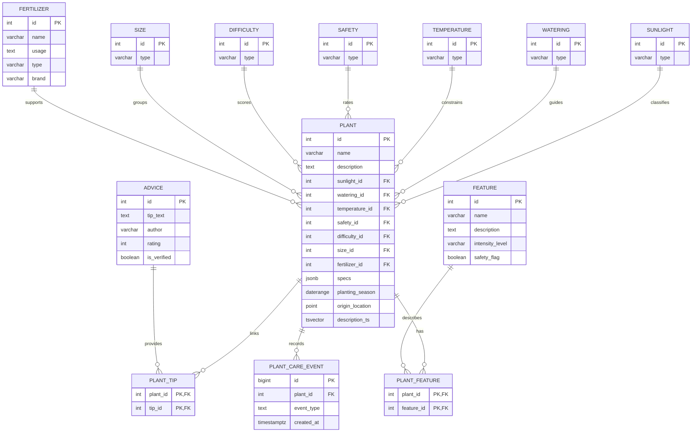
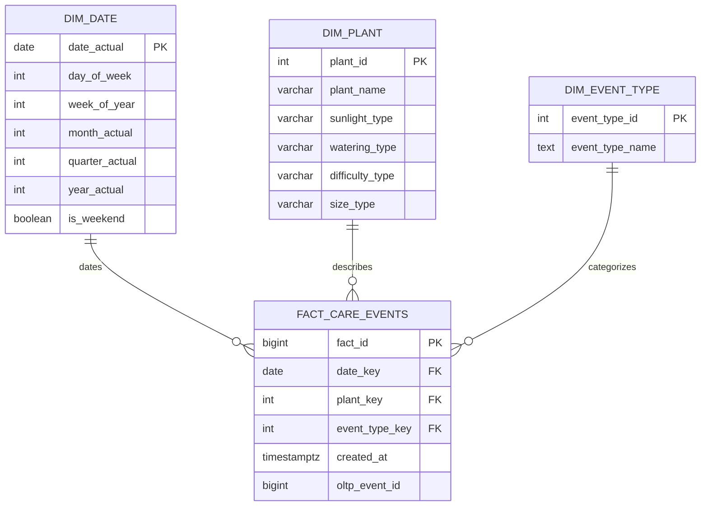

# Grow-Up-Bro

Grow-Up-Bro is a university database project that grew from a normalized plant-care catalog into a broader exploration of data systems. The domain is practical and easy to reason about: plants, their biological and care characteristics, fertilizers, expert advice, and care events. Around that domain, the repository preserves coursework on relational design, query planning, indexing, transactions, replication, partitioning, queues, analytical modeling, and several NoSQL technologies.

Most detailed lab reports are written in Russian.

## Project Idea

The original problem is the lack of a structured, centralized source of plant-care knowledge. The database models plants together with:

- light, watering, temperature, safety, difficulty, and size reference data;
- fertilizers and usage notes;
- expert advice and many-to-many plant-advice links;
- plant features and many-to-many plant-feature links;
- care events that can later feed analytics and notification logic.

The project then uses this model as a stable playground for deeper database topics: large synthetic datasets, PostgreSQL index behavior, monitoring, replication, queue processing, and OLAP pipelines.

## Repository Map

| Path | What is inside |
| --- | --- |
| [`s1/`](s1/) | First-semester foundation: project description, ER diagrams, database creation scripts, initial schema, inserts, updates, normalization notes, and relational algebra examples. |
| [`s1/homework_4/`](s1/homework_4/) | SELECT and JOIN practice: projections, aliases, computed columns, `CASE`, filters, sorting, `LIKE`, `DISTINCT`, limits, and inner, outer, and cross joins. |
| [`s1/homework_5/`](s1/homework_5/) | Aggregation practice: `COUNT`, `SUM`, `AVG`, `MIN`, `MAX`, `STRING_AGG`, `GROUP BY`, `HAVING`, `GROUPING SETS`, `ROLLUP`, and `CUBE`. |
| [`s1/homework_6/`](s1/homework_6/) | Subquery practice across `SELECT`, `FROM`, `WHERE`, and `HAVING`, including `ALL`, `ANY`, `IN`, `EXISTS`, row comparisons, and correlated subqueries. |
| [`s1/homework_7/`](s1/homework_7/) | CTEs, set operations, and window functions: `UNION`, `INTERSECT`, `EXCEPT`, `PARTITION BY`, frame clauses, ranking, and offset functions. |
| [`s1/homework_8/`](s1/homework_8/) | Transaction exercises: `COMMIT`, `ROLLBACK`, transaction errors, PostgreSQL isolation levels, phantom/non-repeatable reads, and `SAVEPOINT`. |
| [`s1/homework_9/`](s1/homework_9/) | PL/pgSQL routines: stored procedures, functions, `DO` blocks, variables, `IF`, `CASE`, `WHILE`, exception handling, and `RAISE`. |
| [`s1/homework_10/`](s1/homework_10/) | Trigger and scheduling practice: `NEW`/`OLD`, `BEFORE`/`AFTER`, row-level and statement-level triggers, logging tables, and `pg_cron` jobs. |
| [`s2/migrations/`](s2/migrations/) | Flyway-style PostgreSQL migrations for the advanced version of the schema: core tables, complex types, roles, generated data, queue tables, care events, and OLAP tables. |
| [`s2/homework_1/`](s2/homework_1/) | Docker Compose setup for PostgreSQL, Flyway, and pgAdmin, plus role validation. |
| [`s2/homework_2/`](s2/homework_2/) | B-tree and hash index experiments with `EXPLAIN ANALYZE` screenshots. |
| [`s2/homework_3/`](s2/homework_3/) | GIN, GiST, JSONB, full-text search, join analysis, Prometheus, and Grafana monitoring. |
| [`s2/homework_4/`](s2/homework_4/) | MVCC visibility, transaction behavior, and storage observations. |
| [`s2/homework_5/`](s2/homework_5/) | WAL inspection, dumps, seed data, and backup-oriented exercises. |
| [`s2/homework_6/`](s2/homework_6/) | Physical and logical PostgreSQL replication with lag analysis. |
| [`s2/homework_7/`](s2/homework_7/) | Range, list, and hash partitioning, partition pruning, logical replication behavior, and `postgres_fdw` sharding. |
| [`s2/homework_8/`](s2/homework_8/) | NoSQL labs across Redis, MongoDB, Cassandra, Elasticsearch, Neo4j, InfluxDB, ClickHouse, and Qdrant. |
| [`s2/homework_9/`](s2/homework_9/) | PostgreSQL-backed priority queue with Java/Spring Boot producers and consumers. |
| [`s2/homework_10/`](s2/homework_10/) | OLAP modeling: fact grain, dimensions, initial loading, and analytical SQL. |
| [`s2/homework_11/`](s2/homework_11/) | Airflow pipeline that loads file data into PostgreSQL and moves OLTP data into ClickHouse. |

## Core OLTP Model

The main schema is split into three logical PostgreSQL schemas:

- `main` for business entities such as plants, fertilizers, advice, and care events;
- `refs` for lookup/reference data;
- `links` for many-to-many relations.



The original first-semester ER diagram is also preserved here: [`s1/ER diagram.png`](s1/ER%20diagram.png).

## OLAP Layer

The analytical part introduces a star-like schema around plant care events. One fact row represents one care action performed for one plant at a specific time.



## What This Project Demonstrates

- Relational modeling with schemas, lookup tables, foreign keys, and many-to-many link tables.
- Normalization decisions and anomaly prevention.
- SQL practice: relational algebra, filtering, joins, grouping, subqueries, CTEs, window functions, functions, procedures, and triggers.
- PostgreSQL advanced data types: `JSONB`, `DATERANGE`, `POINT`, and `tsvector`.
- Index experiments with B-tree, hash, GIN, and GiST indexes.
- Query plan analysis through `EXPLAIN ANALYZE` and buffer metrics.
- PostgreSQL roles and access control for different user personas.
- Synthetic high-volume data generation for performance experiments.
- MVCC, transactions, WAL, backups, physical replication, logical replication, and replica lag analysis.
- Partitioning strategies and sharding through `postgres_fdw`.
- A PostgreSQL-backed priority queue with `FOR UPDATE SKIP LOCKED`, retry logic, exponential backoff, and `LISTEN` / `NOTIFY`.
- NoSQL comparison labs across document, graph, search, time-series, cache, column-family, vector, and analytical databases.
- OLTP-to-OLAP modeling, ClickHouse marts, materialized views, and Airflow DAGs.

## Running Selected Parts

The repository contains several independent lab environments. Start from the folder of the lab you want to explore.

```bash
# PostgreSQL, Flyway, and pgAdmin
cd s2/homework_1
docker compose up -d
```

```bash
# Airflow, PostgreSQL, Flyway, pgAdmin, and ClickHouse
cd s2/homework_11
docker compose up -d
```

```bash
# Java queue demo
cd s2/homework_9/queue-java
mvn spring-boot:run
```

The Docker Compose file already includes a built-in environment that doesn't contain secrets detrimental to local development, but you can replace them with your own.

## Why It Matters

This project is a compact record of how a database model can evolve: first as a clean normalized schema, then as a system that has to be queried, indexed, monitored, replicated, partitioned, fed into queues, compared with NoSQL alternatives, and finally analyzed through OLAP pipelines. It keeps the practical learning path visible instead of hiding it behind a finished-only result.

## Support & Contact

Have questions? Need help with setup? Found a bug?

Email: **mairabeeva42@gmail.com** | Telegram: @arinkmm
