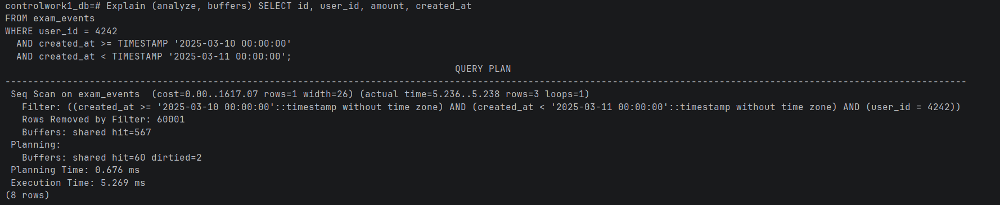
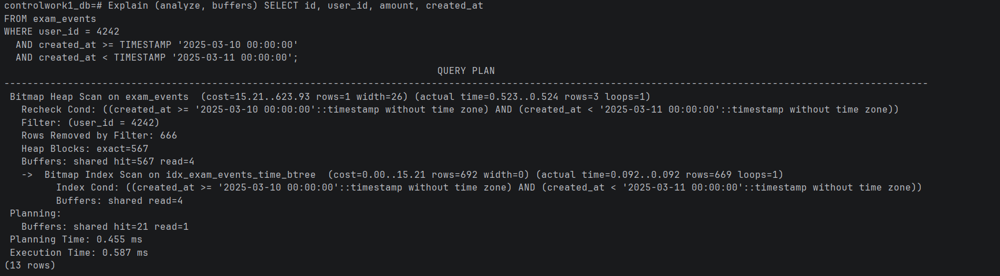
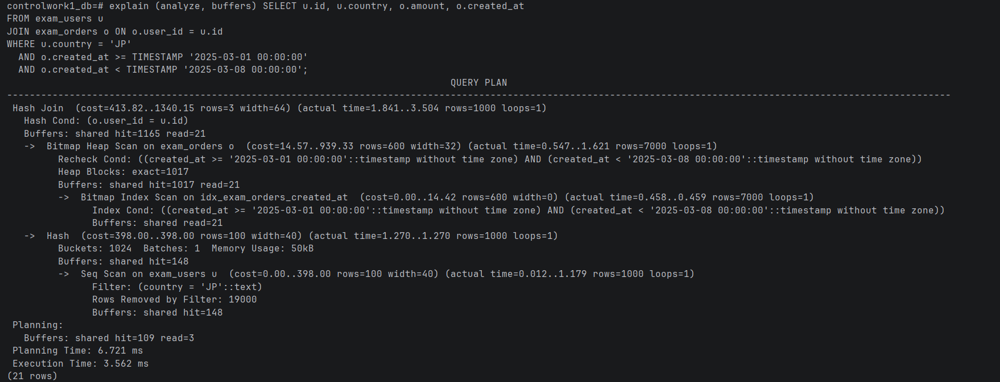
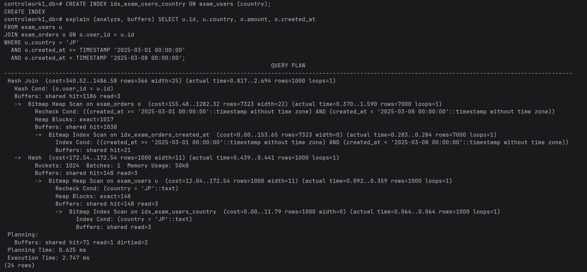
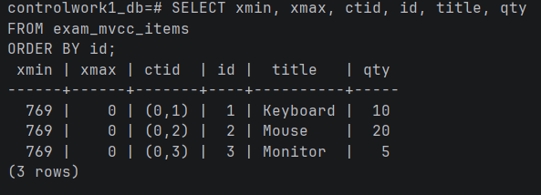
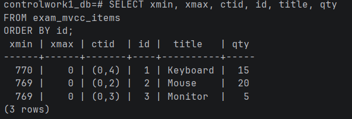
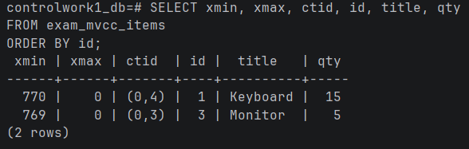

## Задание 1

Запрос:

```sql
SELECT id, user_id, amount, created_at
FROM exam_events
WHERE user_id = 4242
  AND created_at >= TIMESTAMP '2025-03-10 00:00:00'
  AND created_at < TIMESTAMP '2025-03-11 00:00:00';
```

Изначально:



Используется полное чтение таблицы. Чтобы оптимизировать запрос, нужно испольщовать индекс конкретно по этому полю. Здесь нет никакой оптимизации поэтому нам ничего не остаётся как прочитать таблицу полностью

Здесь подойдёт btree индекс, так как он хорошо работает с диапазонами

```sql
create index idx_exam_events_time_btree ON exam_events(created_at);
```



Теперь у нас Bitmap Index Scan, он работает по принцицу создания битовой карты и применяется когда данных много и чтобы не прыгать по таблице, явно быстрее полного чтения

Analyze вызывать не нужно, так как индекс сам выстроил данные оптимальным образом

## Задание 2

Исходный запрос:

```sql
SELECT u.id, u.country, o.amount, o.created_at
FROM exam_users u
JOIN exam_orders o ON o.user_id = u.id
WHERE u.country = 'JP'
  AND o.created_at >= TIMESTAMP '2025-03-01 00:00:00'
  AND o.created_at < TIMESTAMP '2025-03-08 00:00:00';
```

Изначально:



Выбран Hash Join, так как одна из таблиц относительно небольшая и по ней можно построить хэш таблицу

Не полезен индекс по имени, а вот индекс по дате вызывает Bitmap Index Scan, ведь он построен по части условия из WHERE

Здесь подойдёт индекс для дополнения условия:

```sql
CREATE INDEX idx_exam_users_country ON exam_users (country);
```



План учучшился, у нас больше нет последовательного чтения

Преобладает hit, так как после первого выполнения данные сохранились в буффер и нет особой надобности читать данные с диска

## Задание 3

```sql
SELECT xmin, xmax, ctid, id, title, qty
FROM exam_mvcc_items
ORDER BY id;

UPDATE exam_mvcc_items
SET qty = qty + 5
WHERE id = 1;

SELECT xmin, xmax, ctid, id, title, qty
FROM exam_mvcc_items
ORDER BY id;

DELETE FROM exam_mvcc_items
WHERE id = 2;

SELECT xmin, xmax, ctid, id, title, qty
FROM exam_mvcc_items
ORDER BY id;
```

Изначально:



После обновления:



xmin - стало теперь номером текущей транзакции, ctid теперь указывает на новое место обновлённой строки
В MVCC обновление = удаление + вставка

После удаления:



Строка изчезла и при выборке она не будет видна пользователю так как помечена удалённой

По очистке - в теории всё расписано

## Задание 4

После отката 1 транзакции обновление завершается, так как снимается блокировка на строку

FOR SHARE - разрешает чтение строки
FOR UPDATE - запрещается изменение строки -> FOR UPDATE сильнее

Без них мы может сделать спокойную выборку

FOR UPDATE имеет смысл использовать когда используется многопоточная работа, чтобы не изменить данные, которые удерживает другой

## Задание 5

```sql
CREATE table exam_measurements (
                                   city_id INTEGER NOT NULL,
                                   log_date DATE NOT NULL,
                                   peaktemp INTEGER,
                                   unitsales INTEGER,
    PRIMARY KEY (log_date)
) PARTITION BY RANGE (log_date);
```

```sql
CREATE TABLE exam_measurements_feb
    PARTITION OF exam_measurements
    FOR VALUES FROM ('2025-02-01') TO ('2025-03-01');

CREATE TABLE exam_measurements_mar
    PARTITION OF exam_measurements
    FOR VALUES FROM ('2025-03-01') TO ('2025-04-01');

CREATE TABLE exam_measurements_ya
    PARTITION OF exam_measurements
    FOR VALUES FROM ('2025-01-01') TO ('2025-02-01');

CREATE TABLE exam_measurements_def
    PARTITION OF exam_measurements DEFAULT;
```


