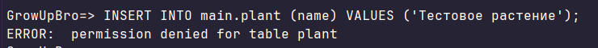
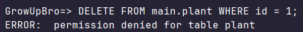
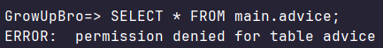

## Список всех ролей

```sql
SELECT rolname, rolcanlogin, rolsuper, rolcreatedb, rolcreaterole, rolinherit
FROM pg_roles
ORDER BY rolname;
```


## Проверка для ботаника

```sql
INSERT INTO main.plant (name) VALUES ('Тестовое растение');
```



## Проверка для менеджера

```sql
DELETE FROM main.plant WHERE id = 1;
```



## Проверка для агронома

```sql
SELECT * FROM main.advice;
```

