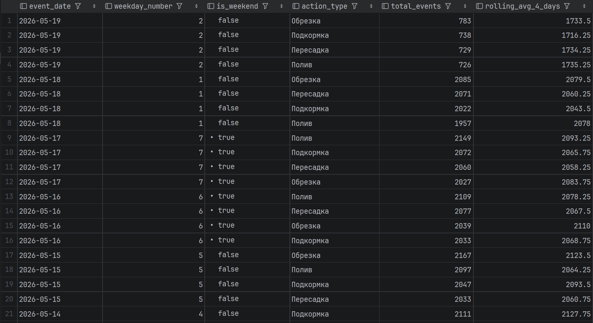
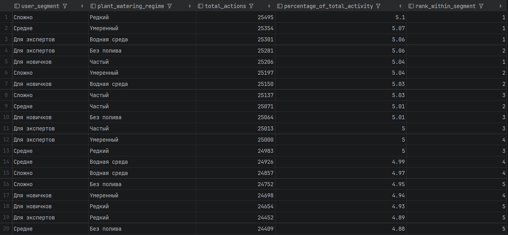
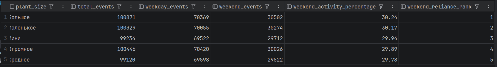

## Аналитические вопросы

1. Какова ежедневная динамика различных типов действий по уходу за растениями? Позволяет ли она выявить пиковые дни нагрузки (например, всплеск поливов в выходные дни) для планирования рассылки пуш-уведомлений пользователям?

2. Какие категории растений (сгруппированные по уровню сложности ухода и требуемому режиму полива) аккумулируют наибольшее количество пользовательских событий? Поможет ли это определить, какие группы пользователей (новички или эксперты) генерируют основной объем активности в приложении?

3. Как распределяется интенсивность ухода за растениями между будними днями и выходными в разрезе габаритов растений? Позволяет ли это выявить категории «домашних питомцев», уход за которыми пользователи массово откладывают на субботу и воскресенье? Это критически важно для оптимизации алгоритма пуш-нотификаций — чтобы не спамить пользователя напоминаниями в рабочее время, если он всё равно ухаживает за большими растениями только по выходным

## Определение Факта и Зерна

Главный факт: `olap.fact_care_events` (Факты событий ухода за растениями)

Зерно факта: 1 строка = одно зарегистрированное событие ухода (конкретное действие над конкретным растением в определенный момент времени)

## Проектирование Измерений

- `olap.dim_date` — измерение времени (дата, день, месяц, квартал, год, день недели) для построения таймлайнов

- `olap.dim_plant` — измерение растений (денормализованные данные: название, тип солнца, полива, сложности и размера), чтобы не делать JOIN со всеми refs-таблицами из OLTP во время аналитики

- `olap.dim_event_type` — измерение типов событий (категоризация действий)

## Проектирование OLAP и заполнение OLAP-таблиц из OLTP-таблиц

- `V7__create_olap_schema.sql` — Чистая DDL миграция схемы

- `V8__seed_olap_static_data.sql` — Дата-миграция/Сид статического измерения дат (Календарь)

- `olap_initial_load.sql` — Сценарий первоначального наполнения (Historical ETL Load) для переноса и денормализации данных из OLTP

## Выполнение аналитических запросов

1. 
```sql
SELECT
d.date_actual AS event_date,
d.day_of_week AS weekday_number,
d.is_weekend,
et.event_type_name AS action_type,
COUNT(f.fact_id) AS total_events,
ROUND(AVG(COUNT(f.fact_id)) OVER (
PARTITION BY et.event_type_id
ORDER BY d.date_actual
ROWS BETWEEN 3 PRECEDING AND CURRENT ROW
), 2) AS rolling_avg_4_days
FROM olap.fact_care_events f
JOIN olap.dim_date d ON f.date_key = d.date_actual
JOIN olap.dim_event_type et ON f.event_type_key = et.event_type_id
WHERE d.month_actual = 5 AND d.year_actual = 2026
GROUP BY d.date_actual, d.day_of_week, d.is_weekend, et.event_type_id, et.event_type_name
ORDER BY event_date DESC, total_events DESC;
```
- `event_date`: Анализируемый календарный день

- `weekday_number`: День недели

- `is_weekend`: Выходной ли день

- `action_type`: Тип ухода

- `total_events`: Всего действий за эти сутки

- `rolling_avg_4_days`: Скользящее среднее за 4 дня



2.
```sql
SELECT
    p.difficulty_type AS user_segment,
    p.watering_type AS plant_watering_regime,
    COUNT(f.fact_id) AS total_actions,
    ROUND(COUNT(f.fact_id) * 100.0 / SUM(COUNT(f.fact_id)) OVER(), 2) AS percentage_of_total_activity,
    RANK() OVER(PARTITION BY p.difficulty_type ORDER BY COUNT(f.fact_id) DESC) AS rank_within_segment
FROM olap.fact_care_events f
         JOIN olap.dim_plant p ON f.plant_key = p.plant_id
GROUP BY p.difficulty_type, p.watering_type
ORDER BY total_actions DESC;
```
- `user_segment`: Сложность ухода за растением

- `plant_watering_regime`: Требуемый регламент полива группы растений

- `total_actions`: Общее количество ивентов для данной категории за всё время

- `percentage_of_total_activity`: Доля этой категории от абсолютно всех событий в системе

- `rank_within_segment`: Рейтинг популярности режимов полива внутри конкретного уровня сложности



3.
```sql
SELECT
    p.size_type AS plant_size,
    COUNT(f.fact_id) AS total_events,
    COUNT(f.fact_id) FILTER (WHERE d.is_weekend = FALSE) AS weekday_events,
    COUNT(f.fact_id) FILTER (WHERE d.is_weekend = TRUE) AS weekend_events,
    ROUND(
            (COUNT(f.fact_id) FILTER (WHERE d.is_weekend = TRUE)) * 100.0 /
            NULLIF(COUNT(f.fact_id), 0), 2
    ) AS weekend_activity_percentage,
    RANK() OVER (ORDER BY (COUNT(f.fact_id) FILTER (WHERE d.is_weekend = TRUE)) * 100.0 / NULLIF(COUNT(f.fact_id), 0) DESC) AS weekend_reliance_rank
FROM olap.fact_care_events f
         JOIN olap.dim_plant p ON f.plant_key = p.plant_id
         JOIN olap.dim_date d ON f.date_key = d.date_actual
GROUP BY p.size_type
ORDER BY weekend_activity_percentage DESC;
```
- `plant_size`: Размер растения

- `total_events`: Сумма всех действий по этому размеру растений

- `weekday_events`: Количество действий, совершенных строго в будни

- `weekend_events`: Количество действий, совершенных в выходные

- `weekend_activity_percentage`: Процент ухода, приходящийся на выходные

- `weekend_reliance_rank`: Ранг размера растения по степени его зависимости от свободных выходных дней

