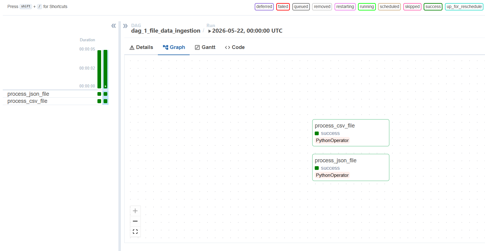
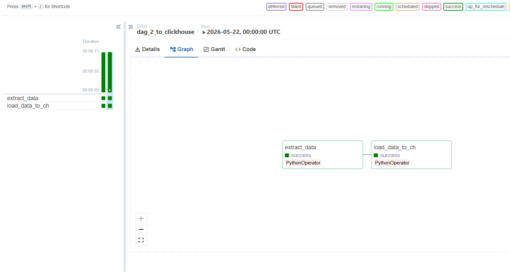
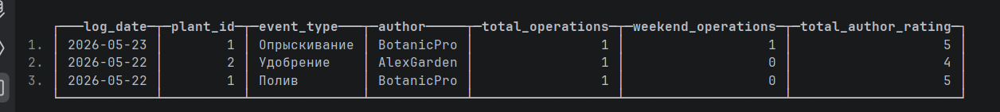

## Источники данных

- Полуструктурированный файл логов `dags/data/care_events.json`
- Табличный документ рекомендаций `dags/data/expert_advices.csv`

## Пополняемые таблицы 

- `main.plant_care_event` — транзакционный лог ухода за растениями (id, plant_id, event_type, created_at)
- `main.advice` — справочник экспертных советов (id, tip_text, author, rating, is_verified)

## Устройство DAGов

1. DAG 1: `dags/dag_1_file_data_ingestion.py`

Реализует параллельное извлечение данных из файлов и загрузку в Postgres

- `process_json_file`: Читает JSON, проверяет схему, выполняет пакетную вставку
- `process_csv_file`: Читает CSV, кастит типы данных, загружает в базу
- 
2. DAG 2: `dags/dag_2_to_clickhouse.py`

Реализует линейный конвейер репликации данных из OLTP в OLAP-хранилище (ClickHouse)

- `extract_data`: Подключается к Postgres, передает массив в XCom
- `load_data_to_ch`: Забирает данные из XCom, производит потоковый Bulk Insert

## Структура ClickHouse (`init-clickhouse/01_init_ch.sql`)

### Источники

- `olap.src_dim_plant` — справочник растений. Хранит метаданные: название, сложность ухода и размер

- `olap.src_plant_care_events` — транзакционный лог событий. Хранит факты ухода (полив, подкормка и т.д.) со штампом времени

- `olap.src_advice` — справочник экспертных рекомендаций. Хранит текстовый контент советов, автора и рейтинг

### Аналитика

- `olap.mart_dashboard_analytics`: Итоговая витрина. Метрики: общее количество операций, активность в выходные и накопленный рейтинг советов

- `olap.mv_dashboard_analytics_pipeline`: Материализованное представление, которое выполняет JOIN между событиями и советами в момент записи, обеспечивая мгновенный доступ к агрегатам

## Идемпотентность и Data Quality

1. Идемпотентность: 

- В Postgres гарантируется конструкциями ON CONFLICT (id) DO NOTHING (для логов) и ON CONFLICT DO NOTHING (для справочника). Повторный запуск тасок не плодит дубли

- В ClickHouse гарантируется за счет движка ReplacingMergeTree(), который очищает дубликаты по Primary Key при мердже

2. Data Quality:

- Реализованы превентивные проверки физического наличия файлов на диске перед запуском парсеров (`os.path.exists`)

- Внедрено принудительное приведение типов (Валидация Boolean-флагов из CSV-строк: item['is_verified'].lower() in ['true', '1', 't'])

## Как запустить проект

1. Сборка и старт контейнеров

```bash
docker-compose up -d
```

2. Настройка подключения к СУБД

В веб-интерфейсе Airflow (`localhost:8080`) переходим в Admin -> Connections и создаем подключение pg_growupbro_conn:

- Conn Type: Postgres
- Host: postgres
- Database: GrowUpBro 
- Login: postgres 
- Password: 08122006Ar 
- Port: 5432

3. Активация конвейера

Последовательно переводим тумблеры в положение Active и нажимаем Trigger DAG для:

- dag_1_file_data_ingestion
- dag_2_to_clickhouse

4. Контроль результатов

После срабатывания триггеров проверяем состояние DAGов:

1. dag_1_file_data_ingestion

2. dag_2_to_clickhouse


Мы видим по 2 таски в каждом DAG: в 1 DAG они параллельны, во 2 DAG они последовательны. Оба успешны

Теперь выполним запрос к витрине на ClickHouse:

```sql
SELECT * FROM olap.mart_dashboard_analytics ORDER BY log_date;
```



