## =

```sql
EXPLAIN (ANALYZE) SELECT * FROM main. plant WHERE name = 'Pacтeниe Тип-150000';

EXPLAIN (ANALYZE, BUFFERS) SELECT * FROM main. plant WHERE name = 'Pacтeниe Тuп-150000';
```
### Без индексов

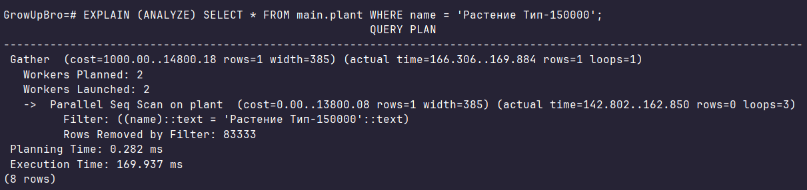


### C b-tree индексом

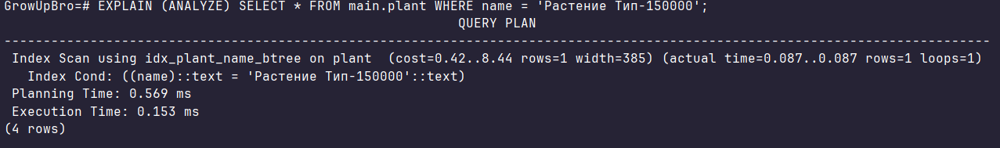
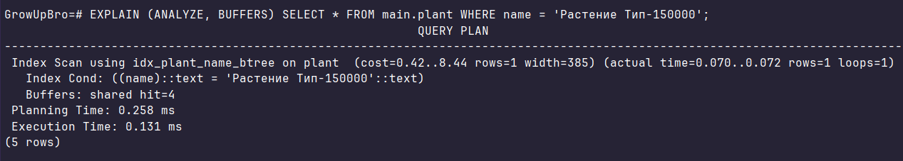

### С hash индексом

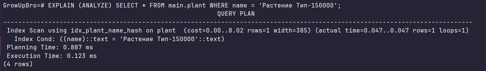
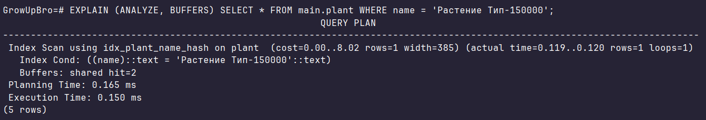

## >

```sql
EXPLAIN (ANALYZE) SELECT * FROM main.plant WHERE sunlight_id > 3;

EXPLAIN (ANALYZE, BUFFERS) SELECT * FROM main.plant WHERE sunlight_id > 3;
```
### Без индексов

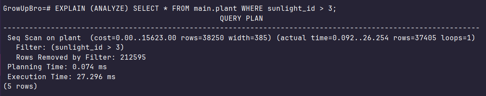
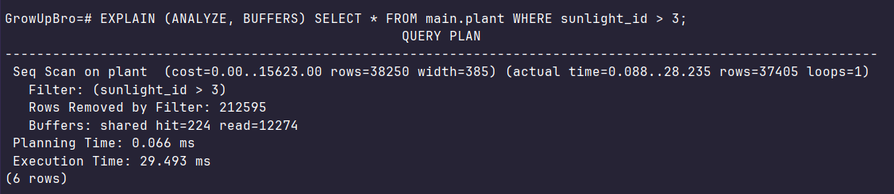

### C b-tree индексом

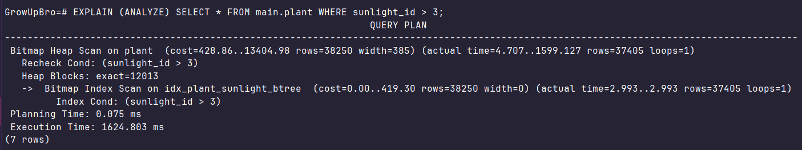
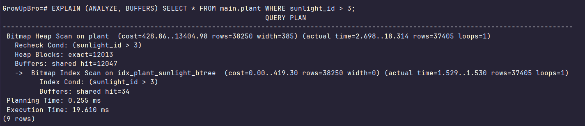

### С hash индексом

Не поддерживается

## <

```sql
EXPLAIN (ANALYZE) SELECT * FROM main.plant WHERE watering_id < 3;

EXPLAIN (ANALYZE, BUFFERS) SELECT * FROM main.plant WHERE watering_id < 3;
```
### Без индексов

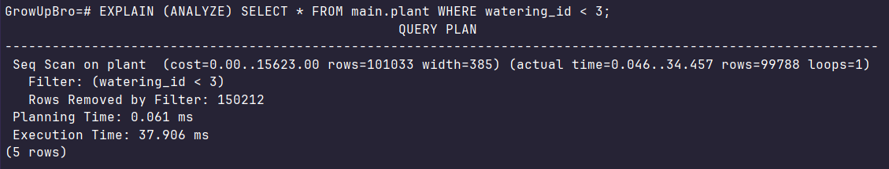


### C b-tree индексом

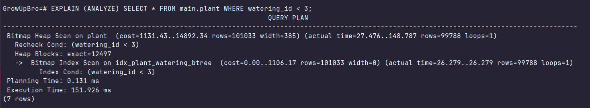
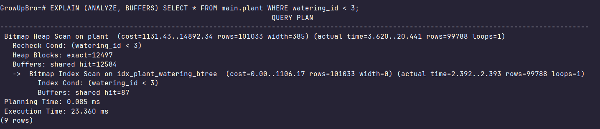

### С hash индексом

Не поддерживается

## %LIKE

```sql
EXPLAIN (ANALYZE) SELECT * FROM main.plant WHERE name LIKE '%35';

EXPLAIN (ANALYZE, BUFFERS) SELECT * FROM main.plant WHERE name LIKE '%35';
```
### Без индексов

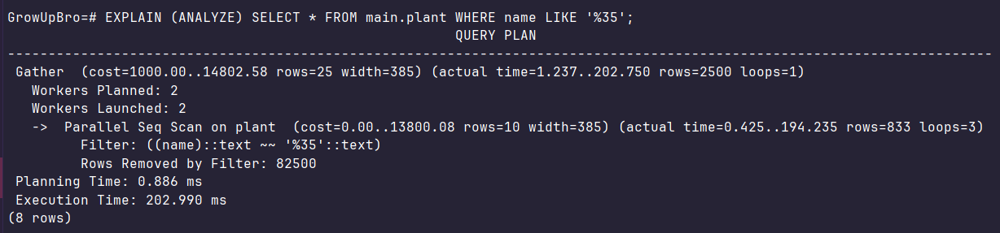
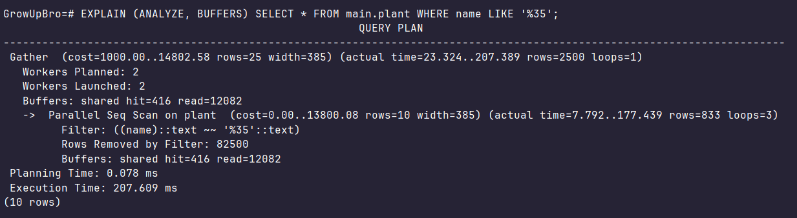

### C b-tree индексом

Не поддерживается

### С hash индексом

Не поддерживается

## LIKE%

```sql
EXPLAIN (ANALYZE) SELECT * FROM main.plant WHERE name LIKE 'Pacтeниe Tип-1%';

EXPLAIN (ANALYZE, BUFFERS) SELECT * FROM main.plant WHERE name LIKE 'Pacтeниe Tип-1%';
```
### Без индексов

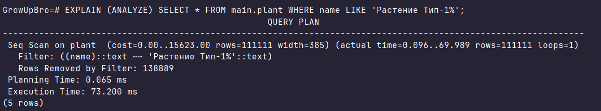
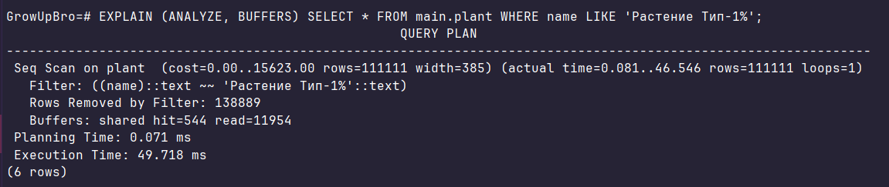

### C b-tree индексом (само выбрало не использовать индексы, связано с тем, что около 44% всех записей в бд, это то что мы ищем и это дольше, чем простой поиск)

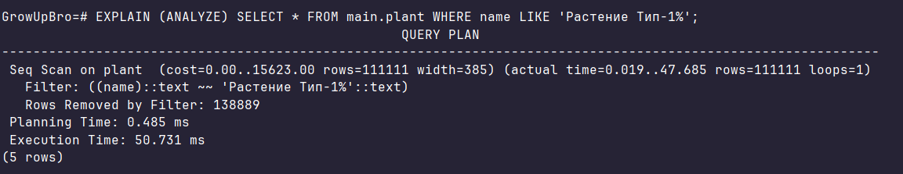
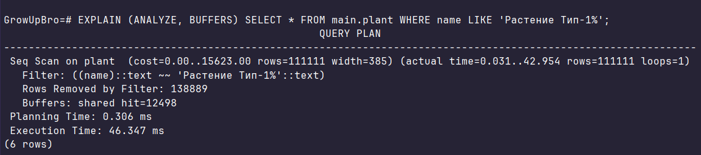

### С hash индексом

Не поддерживается

## IN

```sql
EXPLAIN (ANALYZE) SELECT * FROM main.plant WHERE sunlight_id IN (2,3,4);

EXPLAIN (ANALYZE, BUFFERS) SELECT * FROM main.plant WHERE sunlight_id IN (2,3,4);
```
### Без индексов

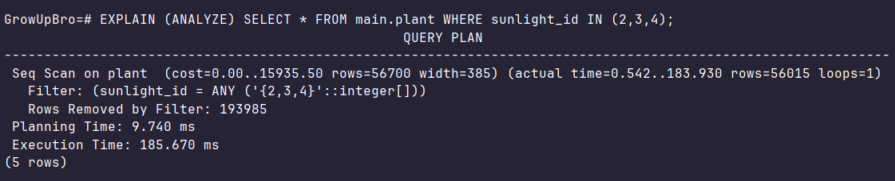
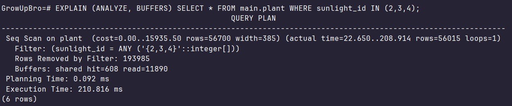

### C b-tree индексом

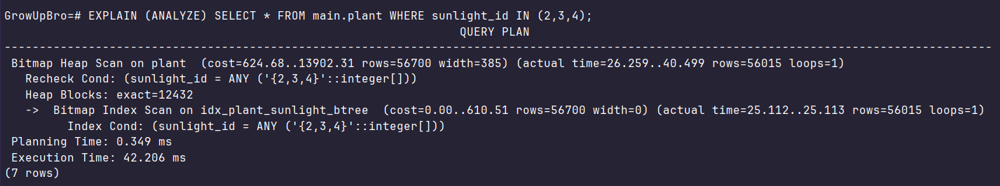


### С hash индексом

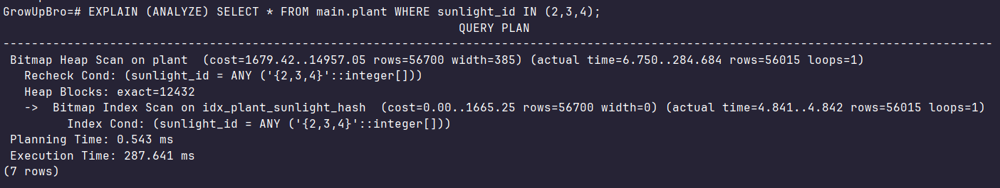
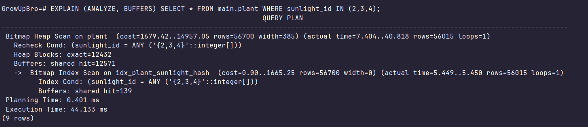

## Составной индекс

```sql
EXPLAIN (ANALYZE) SELECT * FROM main.plant WHERE watering_id = 3 AND fertilizer_id > 4000;

EXPLAIN (ANALYZE, BUFFERS) SELECT * FROM main.plant WHERE watering_id = 3 AND fertilizer_id > 4000;
```
### Без индексов

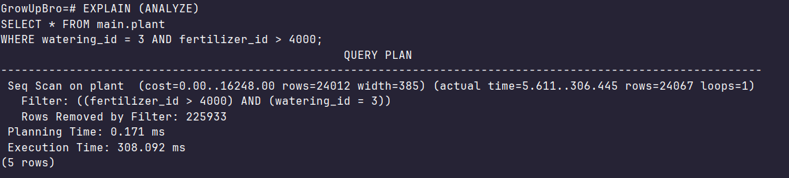


### C индексом

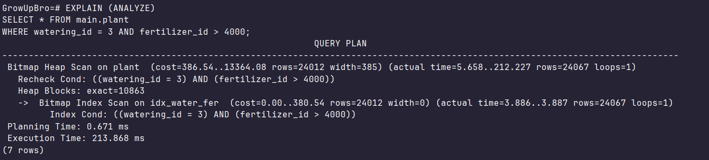
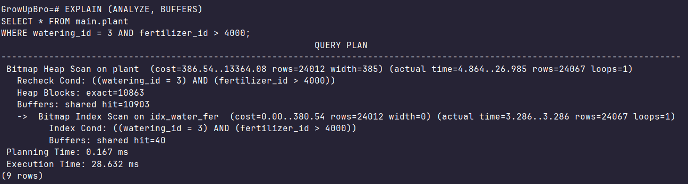
