## GIN

1. Создание индекса для поиска по ключам и значениям внутри JSONB-поля
```sql
CREATE INDEX idx_plant_specs_gin ON main.plant USING gin (specs);
```

2. Создание индекса для полнотекстового поиска
```sql
CREATE INDEX idx_plant_description_ts_gin ON main.plant USING gin (description_ts);
```

3. Полнотекстовый поиск
```sql
EXPLAIN ANALYZE SELECT name FROM main.plant 
WHERE description_ts @@ to_tsquery('russian', '1');
```
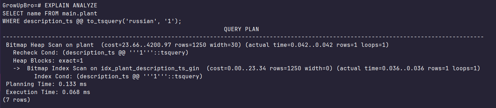

4. Проверка содержания в JSON данных
```sql
EXPLAIN ANALYZE SELECT name FROM main.plant
WHERE specs @> '{"id_инфо": 20}';
```
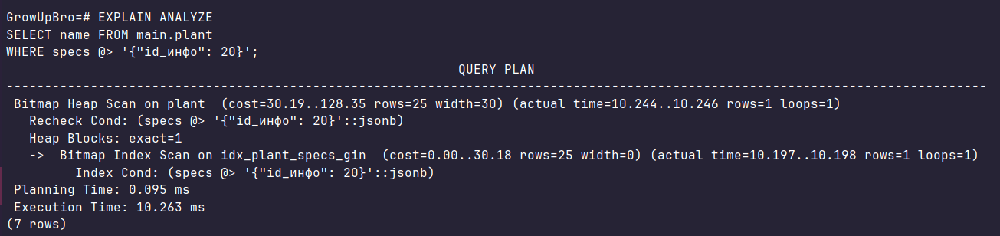

5. Оператор ->> вытаскивает значение как текст и сравнивает его. Индекс GIN тут не поможет
```sql
EXPLAIN ANALYZE SELECT name FROM main.plant 
WHERE specs @> '{"id_инфо": 100}';
```
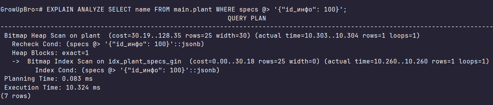

```sql
EXPLAIN ANALYZE SELECT name FROM main.plant 
WHERE specs ->> 'id_инфо' = '100';
```
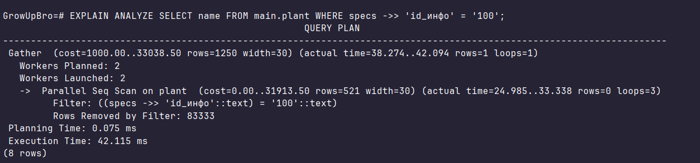

## GiST

1. Создание индекса для интервалов дат
```sql
CREATE INDEX idx_plant_season_gist ON main.plant USING gist (planting_season);
```

2. Создание пространственного индекса для координат (точек на карте)
```sql
CREATE INDEX idx_plant_location_gist ON main.plant USING gist (origin_location);
```

3. Гео-поиск
```sql
EXPLAIN ANALYZE SELECT name, origin_location FROM main.plant 
WHERE origin_location <@ box '(50, 50), (0, 0)';
```
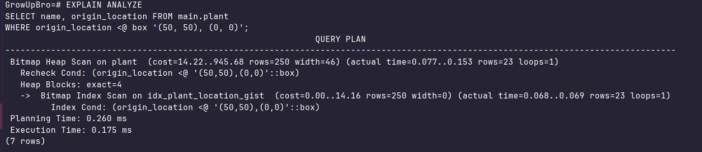

4. Проверка вхождения даты в интервал
```sql
EXPLAIN ANALYZE SELECT name FROM main.plant 
WHERE planting_season @> '2026-12-15'::date;
```
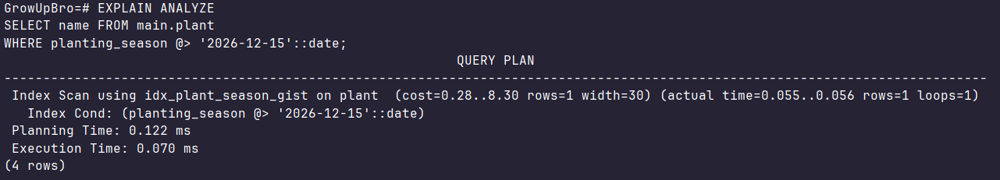

5. Поиск по координатам через обычные числа работает медленнее, чем GiST, так как база проверяет X и Y отдельно
```sql
EXPLAIN ANALYZE SELECT name FROM main.plant 
WHERE origin_location[0] BETWEEN 0 AND 10 
  AND origin_location[1] BETWEEN 0 AND 10;
```
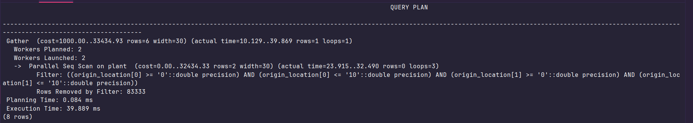

```sql
EXPLAIN ANALYZE SELECT name FROM main.plant 
WHERE origin_location <@ box '(10, 10), (0, 0)';
```
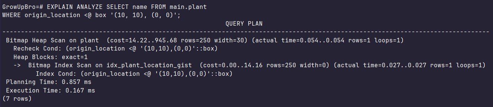

## JOIN

1. Полная карточка растения
```sql
EXPLAIN ANALYZE
SELECT p.name, s.type as sunlight, d.type as difficulty, f.name as fertilizer
FROM main.plant p
JOIN refs.sunlight s ON p.sunlight_id = s.id
JOIN refs.difficulty d ON p.difficulty_id = d.id
JOIN main.fertilizer f ON p.fertilizer_id = f.id;
```
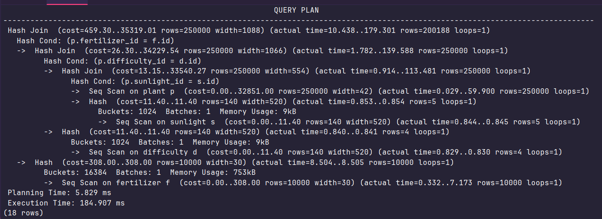

2. Советы только для очень больших растений
```sql
EXPLAIN ANALYZE
SELECT p.name, a.tip_text
FROM main.plant p
JOIN refs.size sz ON p.size_id = sz.id
JOIN links.plant_tip pt ON p.id = pt.plant_id
JOIN main.advice a ON pt.tip_id = a.id
WHERE sz.type = 'Огромное';
```
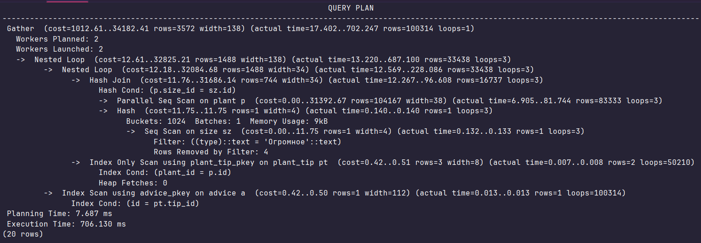

3. Сколько растений привязано к каждому бренду удобрений
```sql
EXPLAIN ANALYZE
SELECT f.brand, COUNT(p.id) as plant_count
FROM main.plant p
JOIN main.fertilizer f ON p.fertilizer_id = f.id
GROUP BY f.brand;
```
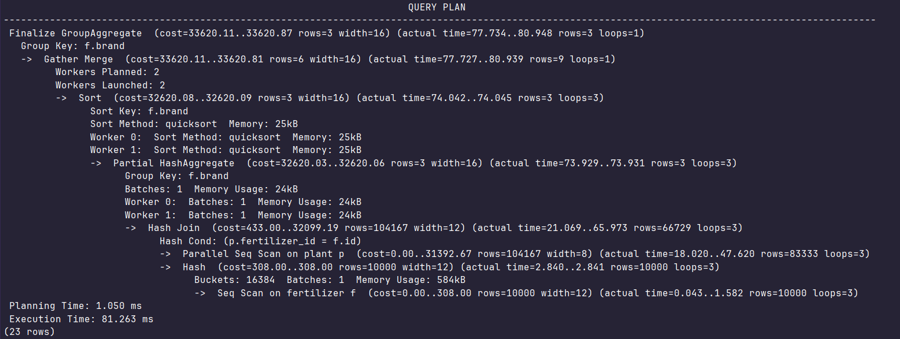

4. «Лишние» советы, которые не привязаны ни к одному растению
```sql
EXPLAIN ANALYZE
SELECT a.tip_text
FROM main.advice a
LEFT JOIN links.plant_tip pt ON a.id = pt.tip_id
WHERE pt.plant_id IS NULL;
```
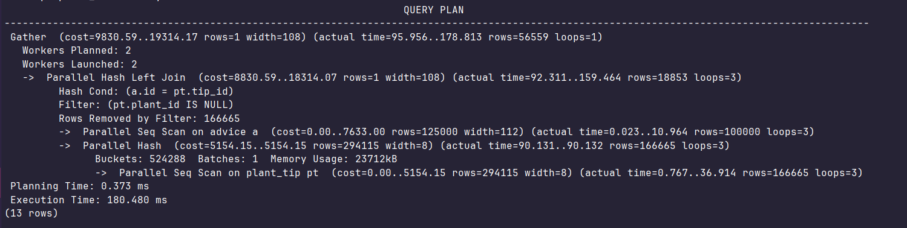

5. Список уникальных авторов, которые давали советы по «зеленым» растениям
```sql
EXPLAIN ANALYZE
SELECT DISTINCT a.author
FROM main.plant p
JOIN links.plant_tip pt ON p.id = pt.plant_id
JOIN main.advice a ON pt.tip_id = a.id
WHERE p.specs @> '{"цвет": "зеленый"}';
```
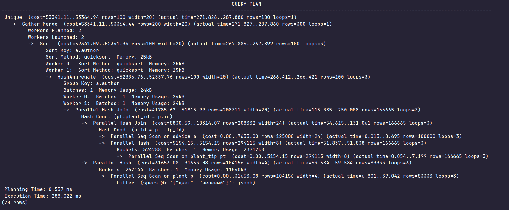

## Grafana

1. Версия Postgres
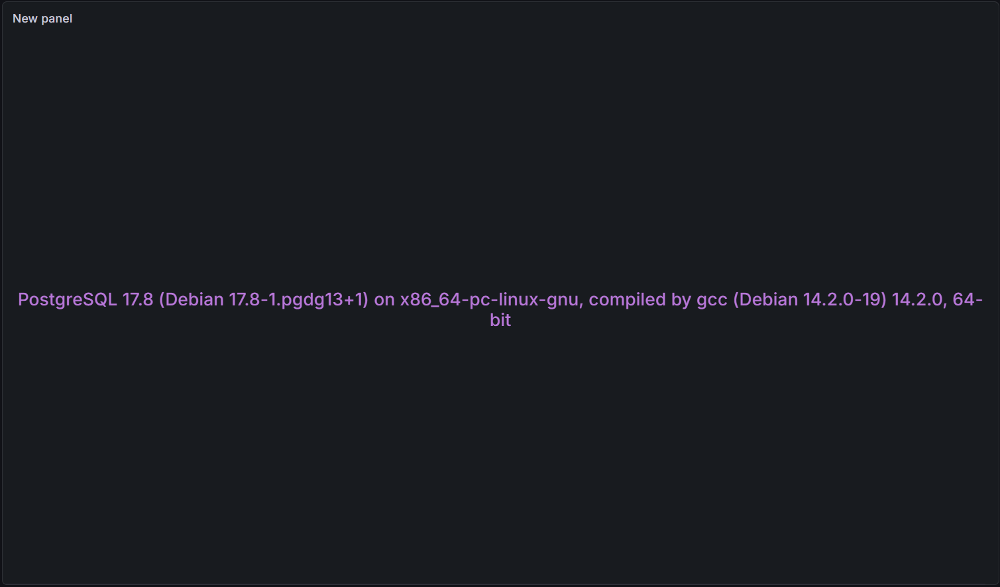

2. Активные сессии
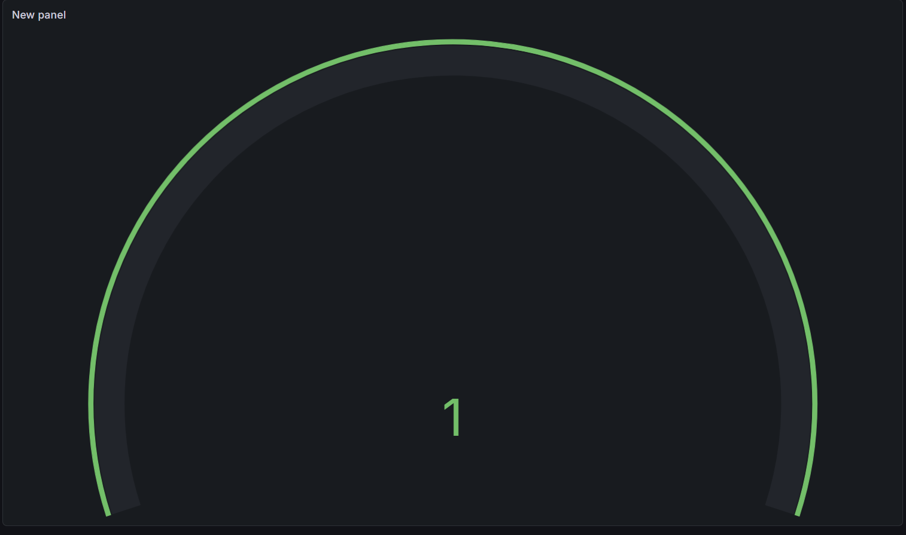

3. График с SELECT, INSERT, DELETE
- irate(pg_detailed_stats_selects[1m])
- irate(pg_detailed_stats_inserts[1m])
- irate(pg_detailed_stats_deletes[1m])
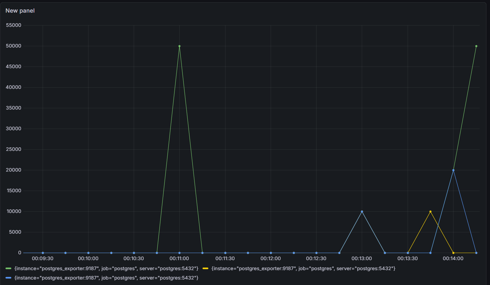

4. Нагрузка на процессор
- (avg(rate(process_cpu_seconds_total{release="$release", instance="$instance"}[5m]) * 1000))

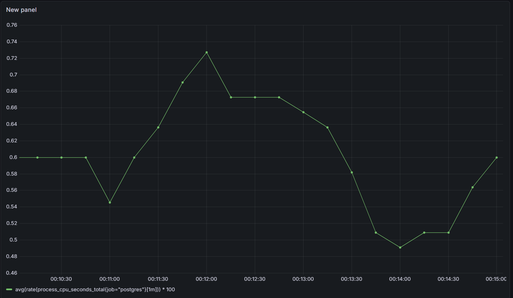