## 1. Моделирование обновления данных

Обновление данных о растении
```sql
SELECT ctid, xmin, xmax, id, difficulty_id 
FROM main.plant WHERE id = 30;
```
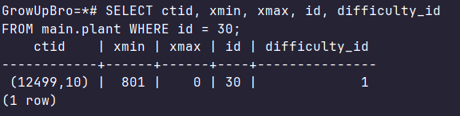

Обновляем
```sql
UPDATE main.plant SET difficulty_id = 4 WHERE id = 30;
```

Повторный select
```sql
SELECT ctid, xmin, xmax, id, difficulty_id 
FROM main.plant WHERE id = 30;
```
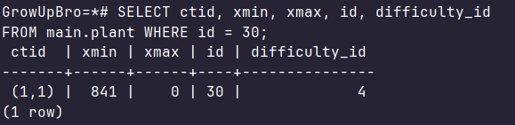

- ctid изменится -  был (12499, 10), стал (1, 1)
- xmin новой строки равен ID текущей транзакции

## 2. Понимание t_infomask

Читаем страницу с уже неакктуальной строкой
```sql
SELECT
    t_ctid,
    t_xmin,
    t_xmax,
    t_infomask,
    (t_infomask & 256) > 0 AS xmin_committed,
    (t_infomask & 1024) > 0 AS xmax_committed,
    (t_infomask & 8192) > 0 AS is_updated
FROM heap_page_items(get_raw_page('main.plant', 12499));
```
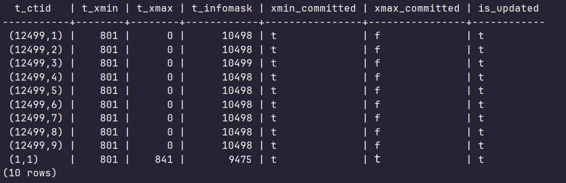

- Маска 256 (0x0100) — XMIN закоммичен
- Маска 1024 (0x0400) — XMAX закоммичен (строка мертва)
- Маска 8192 (0x2000) — Строка была обновлена

t_ctid последней строки указывает на новое рассположение акктуальных данных. t_xmax теперь равен ID транзакции, которая изменила(удалила) эту строку. Также по поводу t_infomask - xmax_committed = true, что говорит, что строка мертва

Читаем страницу с акктуальной строкой
```sql
SELECT
    t_ctid,
    t_xmin,
    t_xmax,
    t_infomask,
    (t_infomask & 256) > 0 AS xmin_committed,
    (t_infomask & 1024) > 0 AS xmax_committed,
    (t_infomask & 8192) > 0 AS is_updated
FROM heap_page_items(get_raw_page('main.plant', 1));
```
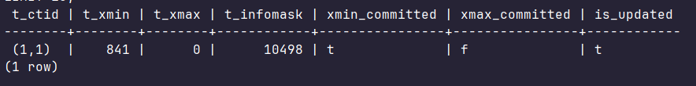

## 3. Видимость в разных транзакциях

1  транзакция
```sql
BEGIN;
SELECT ctid, xmin, xmax, id, difficulty_id 
FROM main.plant WHERE id = 60;
```
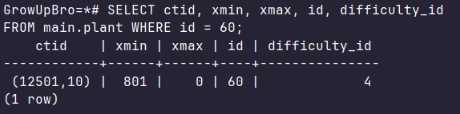

2 транзакция
```sql
UPDATE main.plant SET difficulty_id = 2 WHERE id = 60;
COMMIT;
```

1 транзакция
```sql
BEGIN;
SELECT ctid, xmin, xmax, id, difficulty_id 
FROM main.plant WHERE id = 60;
COMMIT;
```
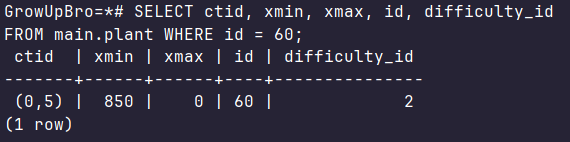

Видим изменения, ctid и xmin меняются по принципу как в 1 пункте

Читаем страницу с уже неакктуальной строкой
```sql
SELECT
    t_ctid,
    t_xmin,
    t_xmax,
    t_infomask,
    (t_infomask & 256) > 0 AS xmin_committed,
    (t_infomask & 1024) > 0 AS xmax_committed,
    (t_infomask & 8192) > 0 AS is_updated
FROM heap_page_items(get_raw_page('main.plant', 12501));
```
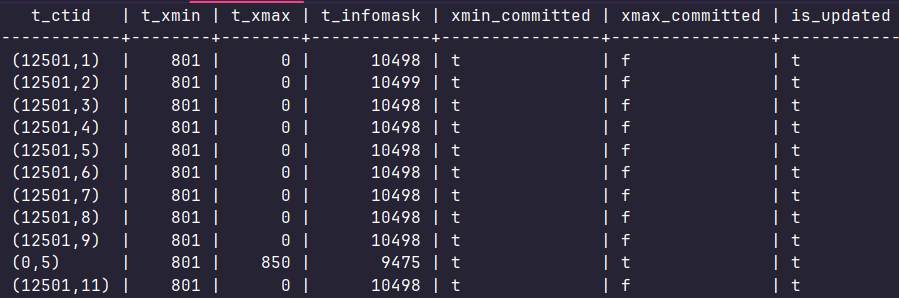

Изменения по принципу пункта 2, основанного также и на пункте 1

Читаем страницу с акктуальной строкой
```sql
SELECT
    t_ctid,
    t_xmin,
    t_xmax,
    t_infomask,
    (t_infomask & 256) > 0 AS xmin_committed,
    (t_infomask & 1024) > 0 AS xmax_committed,
    (t_infomask & 8192) > 0 AS is_updated
FROM heap_page_items(get_raw_page('main.plant', 0));
```
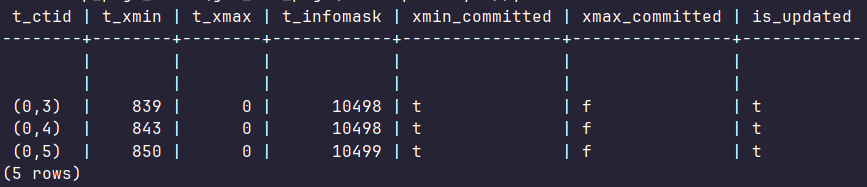

## 4. Моделирование дедлока

2 транзакции обновляют независимые строки в таблице 

1 транзакция
```sql
BEGIN;
UPDATE main.fertilizer SET brand = 'AgroX_New' WHERE id = 1;
```

2 транзакция
```sql
BEGIN;
UPDATE main.fertilizer SET brand = 'BioGarden_New' WHERE id = 2;
```

1 транзакция
```sql
UPDATE main.fertilizer SET brand = 'BioGarden_New' WHERE id = 2;
```
1 транзакция решит обновить строку, заблокированную 2 транзакцией и ждёт её

2 транзакция
```sql
UPDATE main.fertilizer SET brand = 'AgroX_New' WHERE id = 1;
```
2 транзакция решит обновить строку, заблокированную 1 транзакцией и ждёт её

Возникает взаимная блокировка, срабатывает Deadlock Detector - 2 транзакция прерывается, 1 транзакция ждёт commit или rollback;
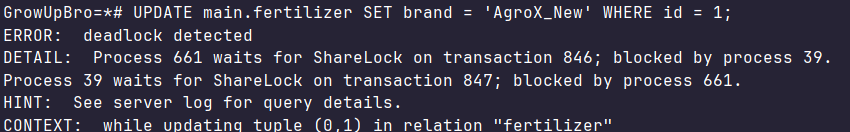

## 5. Явные блокировки

1 транзакция

Запрашиваем блокировку строки на изменения
```sql
BEGIN;
SELECT * FROM main.plant WHERE id = 1 FOR UPDATE;
```

2 транзакция
```sql
UPDATE main.plant SET safety_id = 4 WHERE id = 1;
```
Пытаемся изменить заблокированную строку - зависание

В отдельной сессии смотрим на наши блокировки
```sql
SELECT 
    locktype, 
    relation::regclass AS table_name, 
    mode, 
    granted, 
    pid 
FROM pg_locks 
WHERE relation = 'main.plant'::regclass;
```
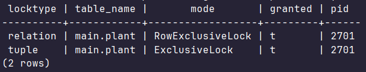

pid 2701 - держит RowExclusiveLock (на таблицу) и ExclusiveLock (на конкретный кортеж tuple). Это наш FOR UPDATE

## 6. Очистка данных

Смотрим количество мертвых кортежей до
```sql
SELECT relname, n_live_tup, n_dead_tup 
FROM pg_stat_user_tables WHERE relname = 'plant';
```
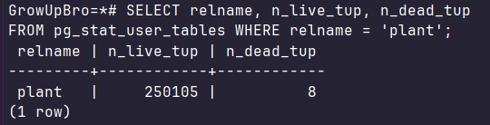

Замеряем размер
```sql
SELECT pg_size_pretty(pg_total_relation_size('main.plant'));
```
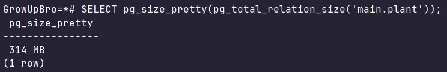

Очищаем
```sql
VACUUM main.plant;
```

Смотрим статистику после
```sql
SELECT relname, n_live_tup, n_dead_tup 
FROM pg_stat_user_tables WHERE relname = 'plant';
```
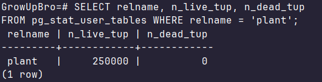

Мертвые кортежи очистились

Замеряем размер повторно
```sql
SELECT pg_size_pretty(pg_total_relation_size('main.plant'));
```
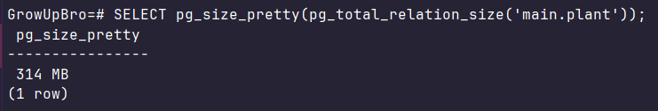

Размер не изменился