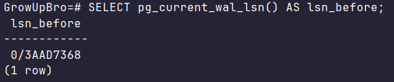
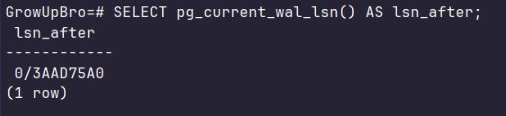
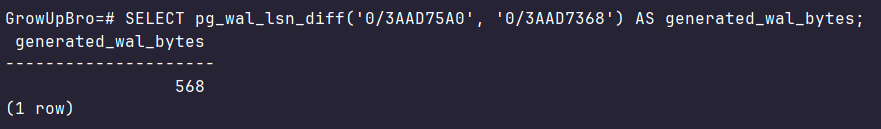
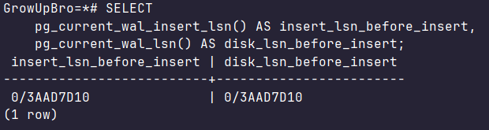
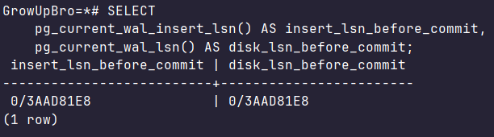
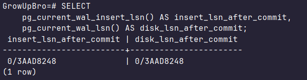
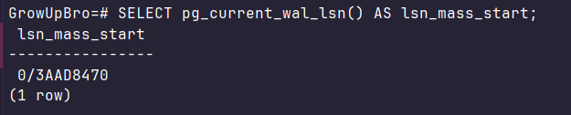
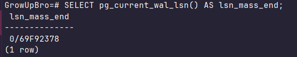
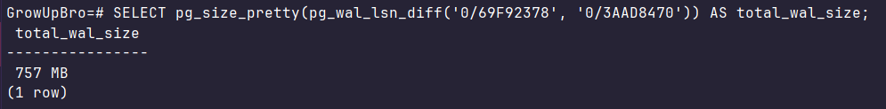
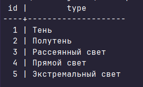

## Сравнение LSN и WAL после изменения данных

### 1. Сравнение LSN до и после INSERT

Получаем стартовый LSN
```sql
SELECT pg_current_wal_lsn() AS lsn_before;
```


Делаем одиночную вставку
```sql
INSERT INTO refs.sunlight (type) VALUES ('Ультрафиолет');
```

Получаем LSN после изменения
```sql
SELECT pg_current_wal_lsn() AS lsn_after;
```


Считаем разницу в байтах
```sql
SELECT pg_wal_lsn_diff('0/3AAD75A0' , '0/3AAD7368') AS generated_wal_bytes;
```


LSN увеличилось после операции вставки

### 2. Сравнение WAL до и после commit

Открываем блок транзакции и получаем LSN из буфера памяти и из диска
```sql
BEGIN;

SELECT pg_current_wal_insert_lsn() AS insert_lsn_before_insert,
    pg_current_wal_lsn() AS disk_lsn_before_insert;
```


Делаем вставку
```sql
INSERT INTO refs.sunlight (type) VALUES ('Инфракрасный');
```

Получаем LSN после вставки, но до коммита
```sql
SELECT pg_current_wal_insert_lsn() AS insert_lsn_before_commit,
    pg_current_wal_lsn() AS disk_lsn_before_commit;
```


Так как вставка была очень маленькой, то WAL Writer уже успел скинуть данные на диск. Поэтому `insert_lsn` и `wal_lsn` будут равны даже при незавершённой транзакции

Фиксируем транзацию и получаем LSN
```sql
COMMIT;

SELECT pg_current_wal_insert_lsn() AS insert_lsn_after_commit,
    pg_current_wal_lsn() AS disk_lsn_after_commit;
```


Значения равны

### 3. Массовая операция

Получаем стартовый LSN
```sql
SELECT pg_current_wal_lsn() AS lsn_mass_start;
```


Выполняем массовое обновление данных
```sql
UPDATE main.plant
SET 
    specs = specs || jsonb_build_object(
        'last_update', '2026-03-17',
        'is_active', true,
        'humidity_level', floor(random()*100)
    ),
    description_ts = to_tsvector('russian', name || ' ' || description)
WHERE id BETWEEN 1 AND 250000;
```

Получает LSN после операции
```sql
SELECT pg_current_wal_lsn() AS lsn_mass_end;
```


Анализируем объём
```sql
SELECT pg_size_pretty(pg_wal_lsn_diff('0/69F92378', '0/3AAD8470')) AS total_wal_size;
```


Данные заняли много места

## Dump

### 1. Dump только структуры базы

С помощью флага -s выгружаем только DDL операции

```
& "C:\Program Files\PostgreSQL\17\bin\pg_dump.exe" -U postgres -s -d GrowUpBro -f schema_only.sql    
```

### 2. Dump одной таблицы

С помощью флага -t ыгружаем только таблицу `refs.sunlight`

```
& "C:\Program Files\PostgreSQL\17\bin\pg_dump.exe" -U postgres -t refs.sunlight -d GrowUpBro -f sunlight_table.sql   
```

### Накатываем на новую чистую БД

Создаём новую БД с помощью SQL: 

```sql
CREATE DATABASE GrowUpBro_New;
```

Накатываем наши dump

```
& "C:\Program Files\PostgreSQL\17\bin\psql.exe" -U postgres -d GrowUpBro_New -f schema_only.sql
& "C:\Program Files\PostgreSQL\17\bin\psql.exe" -U postgres -d GrowUpBro_New -f sunlight_table.sql   
```

Проверяем:

```
& "C:\Program Files\PostgreSQL\17\bin\psql.exe" -U postgres -d GrowUpBro_New -c "SELECT * FROM refs.sunlight;" 
```


## Seed

1. Если такие данные уже есть в `refs.sunlight`, то игнорируем попытку повторной вставки (seeds/seed_references.sql)

Данный seed идемпотентен, если мы будет повторять попытки вставки, когда такие данные уже будут в таблице, то ничего не будет происходить 

2. Если такие данные уже есть в `refs.watering`, то игнорируем попытку повторной вставки (seeds/seed_references.sql)

Данный seed идемпотентен, если мы будет повторять попытки вставки, когда такие данные уже будут в таблице, то ничего не будет происходить

3. Если такое название растения уже есть в `main.fertilizer`, то обновляем его данные (seeds/seed_fertilizer.sql)

Ключевое слово EXCLUDED обращается к тем значениям, которые мы пытались вставить

Данный seed идемпотентен, если мы будем повторять попытки вставки, когда такие данные уже есть, то они просто будут обновляться указанными данными в самом запросе
