## Архитектура

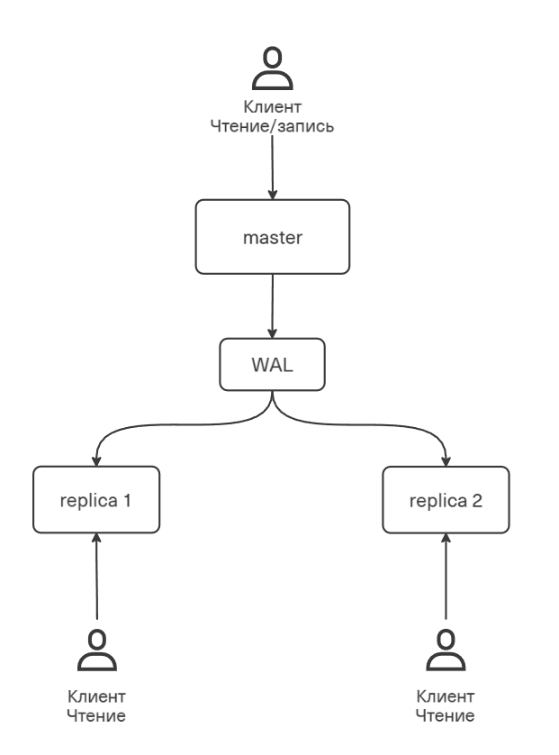

## Настройка потоковой репликации

1. Запускаем `docker-compose.yml` (инициализируем мастера и 2 реплики)
2. Редактируем конфиг мастера (`master.conf`):

```
wal_level = replica
max_wal_senders = 10
max_replication_slots = 10
listen_addresses = '*'
```

3. Изменяем `pg_hba.conf`:

```bash
 echo "host replication replicator 0.0.0.0/0 md5" >> /var/lib/postgresql/data/pg_hba.conf
```

Не перезапуская контейнер обновляем:

```sql
SELECT pg_reload_conf();
```

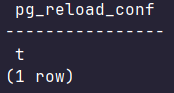

4. Создаём пользователя репликации на мастер:

```sql
CREATE ROLE replicator WITH REPLICATION LOGIN PASSWORD 'reppass';
```

5. В replica 1 и replica 2 очищаем директорию с данными, готовим для репликации:

```bash
rm -rf /var/lib/postgresql/data/*
```

6. В replica 1 и replica 2 копирует все данные с мастера на реплики:

```bash
pg_basebackup -h pg_master -D /var/lib/postgresql/data -U replicator -P -R
```

## Проверка репликации

Вставляем данные:

```sql
INSERT INTO refs.temperature (type) VALUES ('Не придирчиво');
```

Проверяем на replica 1 и replica 2:

```sql
SELECT * FROM refs.temperature;
```

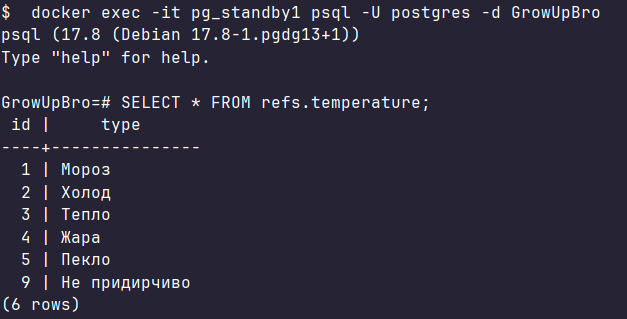

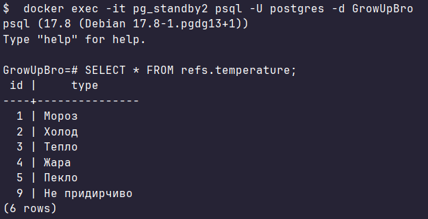

Попытаемся записать данные на одну из реплик:

```sql
INSERT INTO refs.size (type) VALUES ('Не постоянно');
```

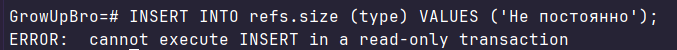

## Анализ replication lag

Создаём нагрузку INSERT на мастера:

```sql
INSERT INTO main.advice (tip_text, author, rating, is_verified)
SELECT 
    'Совет ' || i || ': ' || md5(random()::text) || ' ' || md5(random()::text),
    'Бот-садовод ' || (i % 1000),
    (random() * 5)::int,
    (random() > 0.5)
FROM generate_series(1, 1000000) i;
```

Наблюдаем lag на мастера:

```sql
SELECT
    client_addr,
    state,
    sent_lsn,
    write_lsn,
    flush_lsn,
    replay_lsn,
    sent_lsn - replay_lsn AS replay_lag_bytes,
    write_lag,
    flush_lag,
    replay_lag
FROM pg_stat_replication;
```

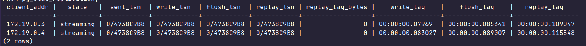

Обе реплики подключены и находятся в статусе streaming. Значение `replay_lag_bytes = 0` означает что реплики полностью синхронизированы с мастером. Задержка репликации (`replay_lag`) составляет около 100ms — реплики практически не отстают от мастера

## Настройка логической репликации

1. Запускаем контейнер в `docker-compose.yml` для реплики

2. Редактируем конфиг мастера (`master.conf`):

```
wal_level = logical
max_wal_senders = 10
max_replication_slots = 10
listen_addresses = '*'
```

3. Создаём публикацию всех таблиц мастера:

```sql
CREATE PUBLICATION master_pub FOR TABLE 
    main.plant, main.fertilizer, main.advice,
    refs.safety, refs.difficulty, refs.size, refs.sunlight, refs.temperature, refs.watering;
```

4. Перед подпиской необходимо создать схему вручную, так как DDL не реплицируется

Для этого используем pg_dump с инициализацией схемы (`homework_5/dumps/schema_only.sql`):

```bash
docker exec -i pg_logical psql -U postgres -d GrowUpBro < C:/IdeaProjects/Grow-Up-Bro/s2/homework_5/dumps/schema_only.sql
```

5. Создаём подписку:

```sql
CREATE SUBSCRIPTION master_sub
    CONNECTION 'host=pg_master port=5432 dbname=GrowUpBro user=postgres password=pass'
    PUBLICATION master_pub;
```

### Проверяем, что данные реплицируются

На мастере вставляем данные:

```sql
INSERT INTO refs.sunlight (type) VALUES ('Ультрафиолет');
```

На реплике:

```sql
SELECT * FROM refs.sunlight;
```

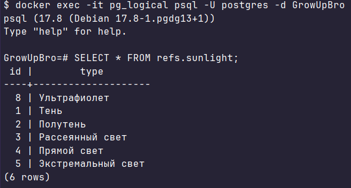

Данные реплицируются

### Проверяем, что DDL не реплицируется

На мастере добавляем колонку в таблицу:

```sql
ALTER TABLE refs.sunlight ADD COLUMN notes TEXT;
```

На реплике:

```sql
 \d refs.sunlight
```

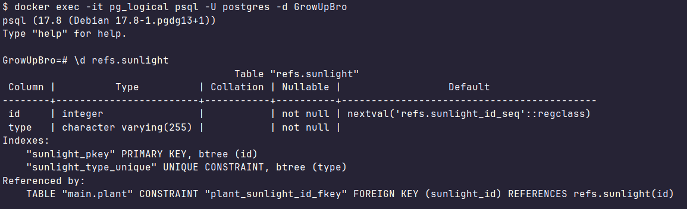

Замечаем, что новой колонки нет

Попробуем на мастере вставить строку с заполненной `notes`:

```sql
INSERT INTO refs.sunlight (type, notes) VALUES ('Тьма', 'Категорически не держать на солнце');
```

На реплике:

```sql
SELECT * FROM refs.sunlight;
```

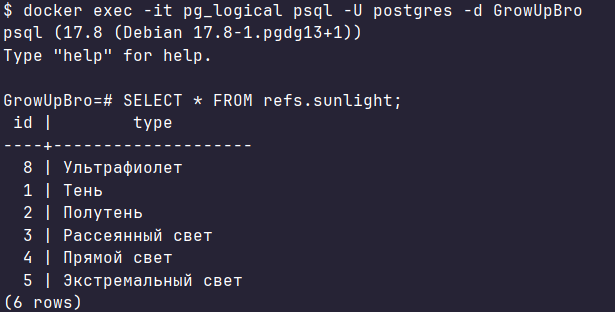

Видим, что таблица осталась без изменений, ведь DDL не реплицируется и у нас нет колонки `notes`, для которой также предназначены данные


## Проверяем REPLICA IDENTITY

На мастере создаём таблицу без PK:

```sql
CREATE TABLE main.plant_notes (
    plant_name TEXT,
    note TEXT
);
```

Добавляем в публикацию:

```sql
ALTER PUBLICATION master_pub ADD TABLE main.plant_notes;
```

На реплике создаём такую же таблицу и вставляем данные:

```sql
INSERT INTO main.plant_notes VALUES ('Роза', 'Требует обрезки');
```

Пробуем сделать UPDATE на мастере:

```sql
UPDATE main.plant_notes SET note = 'Обрезка противопоказана' WHERE plant_name = 'Роза';
```

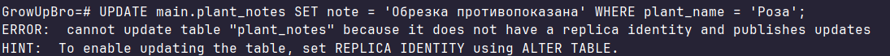

Ошибка возникает из-за того, что нет возможности идентифицировать строку для обновления без PK


## Статус репликации

1. На мастере смотрим слоты репликации:

```sql
SELECT slot_name, slot_type, active, restart_lsn, confirmed_flush_lsn
FROM pg_replication_slots;
```

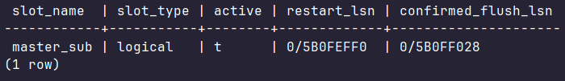

Логическая реплика успешно запущена. `confirmed_flush_lsn` - адрес (0/5B0F5438), до которого данные гарантированно записаны на диск подписчика; `restart_lsn` - адрес в логах, начиная с которого мастер обязан хранить данные для конкретной реплики

2. На мастере смотрим детали по каждому подписчику:

```sql
SELECT pid, application_name, state, sent_lsn, replay_lsn, replay_lag
FROM pg_stat_replication;
```

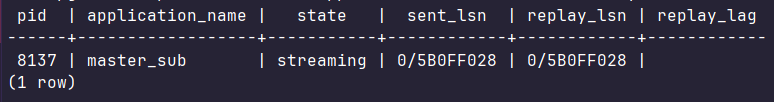

`sent_lsn` - что мастер уже отправил, `replay_lsn` - что реплика уже применила у себя. Данные совпадают, реплика актуальна

3. На реплике смотрим статус подписки:

```sql
SELECT subname, received_lsn, last_msg_send_time, last_msg_receipt_time,
       latest_end_lsn, latest_end_time
FROM pg_stat_subscription;
```

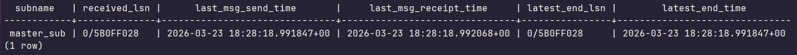

Задержка сети (`last_msg_receipt_time` vs `last_msg_send_time`) практически отсутствует