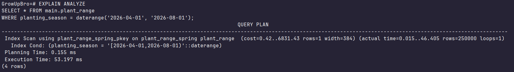
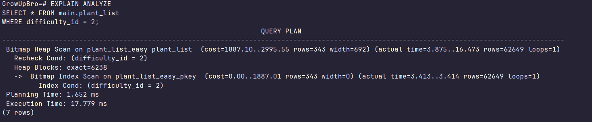
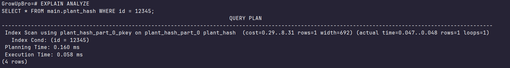
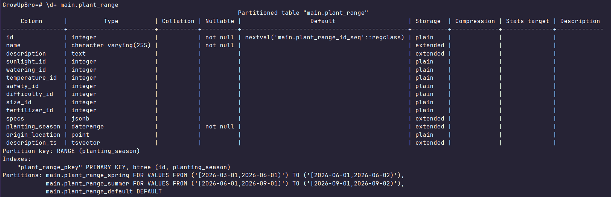
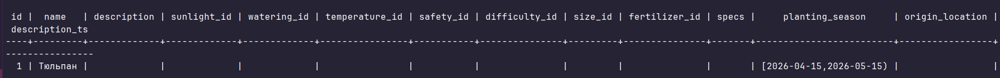
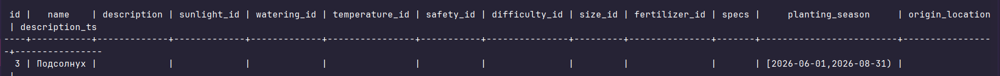
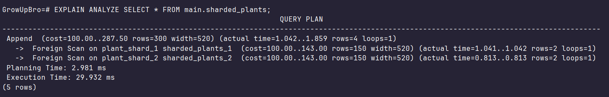
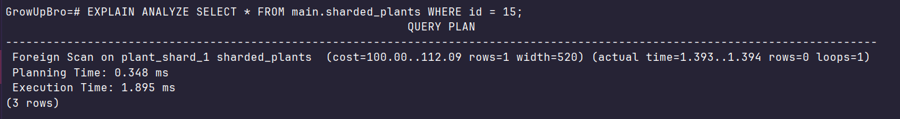

## Секционирование

### RANGE

1. Создаём секционированную таблицу:

```sql
CREATE TABLE main.plant_range (
    id SERIAL,
    name VARCHAR(255) NOT NULL,
    description TEXT,
    sunlight_id INT,
    watering_id INT,
    temperature_id INT,
    safety_id INT,
    difficulty_id INT,
    size_id INT,
    fertilizer_id INT,
    specs JSONB,
    planting_season DATERANGE NOT NULL,
    origin_location POINT,
    description_ts tsvector,
    PRIMARY KEY (id, planting_season) 
) PARTITION BY RANGE (planting_season);
```

2. Создаём секции по диапазону `planting_season`:

- Секция для весны

```sql
CREATE TABLE main.plant_range_spring 
    PARTITION OF main.plant_range
    FOR VALUES FROM ('[2026-03-01, 2026-06-01)') TO ('[2026-06-01, 2026-06-02)');
```

- Секция для лета

```sql
CREATE TABLE main.plant_range_summer 
    PARTITION OF main.plant_range
    FOR VALUES FROM ('[2026-06-01, 2026-09-01)') TO ('[2026-09-01, 2026-09-02)');
```

- Секция по умолчанию

```sql
CREATE TABLE main.plant_range_default 
    PARTITION OF main.plant_range DEFAULT;
```

3. Копируем данные из старой таблицы в новую:

```sql
INSERT INTO main.plant_range 
SELECT * FROM main.plant
WHERE planting_season IS NOT NULL;
```

4. Проверяем план запроса:

```sql
EXPLAIN ANALYZE
SELECT * FROM main.plant_range
WHERE planting_season = daterange('2026-04-01' , '2026-08-01');
```



Наблюдаем partition prunning - задействована только 1 из 3 секций, где лежат растения с таким `planting_season`.
Используется Index Scan за счёт локального индекса на первичном ключе

### LIST

1. Создаём секционированную таблицу:

```sql
CREATE TABLE main.plant_list (
    id SERIAL,
    name VARCHAR(255) NOT NULL,
    description TEXT,
    sunlight_id INT,
    watering_id INT,
    temperature_id INT,
    safety_id INT,
    difficulty_id INT NOT NULL,
    size_id INT,
    fertilizer_id INT,
    specs JSONB,
    planting_season DATERANGE,
    origin_location POINT,
    description_ts tsvector,
    PRIMARY KEY (id, difficulty_id)
) PARTITION BY LIST (difficulty_id);
```

2. Создаём секции по значениям `difficulty_id`:

- Секция для простых растений

```sql
CREATE TABLE main.plant_list_easy
    PARTITION OF main.plant_list FOR VALUES IN (1, 2);
```

- Секция для требовательных растений

```sql
CREATE TABLE main.plant_list_hard
    PARTITION OF main.plant_list FOR VALUES IN (3, 4);
```

- Секция по умолчанию

```sql
CREATE TABLE main.plant_list_default
    PARTITION OF main.plant_list DEFAULT;
```

3. Копируем данные из старой таблицы в новую:

```sql
INSERT INTO main.plant_list
SELECT * FROM main.plant
WHERE difficulty_id IS NOT NULL;
```

4. Проверяем план запроса:

```sql
EXPLAIN ANALYZE
SELECT * FROM main.plant_list
WHERE difficulty_id = 2;
```


Наблюдаем partition prunning - задействована только 1 из 3 секций, где лежат растения с таким `difficulty_id`.
Используется Bitmap Index Scan (итоговый результат большой) за счёт локального индекса на первичном ключе

### HASH

1. Создаём секционированную таблицу:

```sql
CREATE TABLE main.plant_hash (
    id INT NOT NULL,
    name VARCHAR(255) NOT NULL,
    description TEXT,
    sunlight_id INT,
    watering_id INT,
    temperature_id INT,
    safety_id INT,
    difficulty_id INT,
    size_id INT,
    fertilizer_id INT,
    specs JSONB,
    planting_season DATERANGE,
    origin_location POINT,
    description_ts tsvector,
    PRIMARY KEY (id)
) PARTITION BY HASH (id);
```

2. Создаём секции:

```sql
CREATE TABLE main.plant_hash_part_0
    PARTITION OF main.plant_hash FOR VALUES WITH (MODULUS 4, REMAINDER 0);

CREATE TABLE main.plant_hash_part_1
    PARTITION OF main.plant_hash FOR VALUES WITH (MODULUS 4, REMAINDER 1);

CREATE TABLE main.plant_hash_part_2
    PARTITION OF main.plant_hash FOR VALUES WITH (MODULUS 4, REMAINDER 2);

CREATE TABLE main.plant_hash_part_3
    PARTITION OF main.plant_hash FOR VALUES WITH (MODULUS 4, REMAINDER 3);
```

3. Копируем данные из старой таблицы в новую:

```sql
INSERT INTO main.plant_hash
SELECT * FROM main.plant;
```

4. Проверяем план запроса:

```sql
EXPLAIN ANALYZE
SELECT * FROM main.plant_hash WHERE id = 12345;
```



Наблюдаем partition prunning - задействована только 1 из 4 секций, где лежит растение с таким `id`.
Используется Index Scan за счёт локального индекса на первичном ключе

## Секционирование и физическая репликация

1. Секционирование есть на реплике

Смотрим подробную информацию о `main.plant_range` на реплике:

```sql
\d+ main.plant_range
```



Видим блок наших секций, значит структура успешно перенеслась на реплику

2. Почему репликация “не знает” про секции?

Физическая репликация не знает о секциях, потому что она оперирует на уровне WAL-дескрипторов блоков данных. Она не вызывает функции планировщика или исполнителя для маршрутизации строк. Тот факт, что на реплике мы видим структуру секций, является побочным эффектом копирования системных таблиц `pg_class` и `pg_inherits` как обычных файлов данных

## Секционирование и логическая репликация

### publish_via_partition_root = off

#### На мастере:

Добавляем родительскую таблицу на публикацию:

```sql
CREATE PUBLICATION pub_plants_raw FOR TABLE main.plant_range;
```

Вставляем данные (БД сама их положит в нужную секцию `main.plant_range_spring`):

```sql
INSERT INTO main.plant_range (name, planting_season) 
VALUES ('Тюльпан', daterange('2026-04-15', '2026-05-15'));
```

#### На реплике:

Подписчик должен иметь таблицы-секции как в мастере. Создаём:

```sql
CREATE TABLE main.plant_range_spring (
    id SERIAL,
    name VARCHAR(255) NOT NULL,
    description TEXT,
    sunlight_id INT,
    watering_id INT,
    temperature_id INT,
    safety_id INT,
    difficulty_id INT,
    size_id INT,
    fertilizer_id INT,
    specs JSONB,
    planting_season DATERANGE NOT NULL,
    origin_location POINT,
    description_ts tsvector
);

CREATE TABLE main.plant_range_summer (
    id SERIAL,
    name VARCHAR(255) NOT NULL,
    description TEXT,
    sunlight_id INT,
    watering_id INT,
    temperature_id INT,
    safety_id INT,
    difficulty_id INT,
    size_id INT,
    fertilizer_id INT,
    specs JSONB,
    planting_season DATERANGE NOT NULL,
    origin_location POINT,
    description_ts tsvector
);

CREATE TABLE main.plant_range_default (
    id SERIAL,
    name VARCHAR(255) NOT NULL,
    description TEXT,
    sunlight_id INT,
    watering_id INT,
    temperature_id INT,
    safety_id INT,
    difficulty_id INT,
    size_id INT,
    fertilizer_id INT,
    specs JSONB,
    planting_season DATERANGE NOT NULL,
    origin_location POINT,
    description_ts tsvector
);
```

Создаём подписку:

```sql
CREATE SUBSCRIPTION sub_plants_raw 
    CONNECTION 'host=pg_master port=5432 dbname=GrowUpBro user=postgres password=pass' 
    PUBLICATION pub_plants_raw;
```

Смотрим на таблицу `main.plant_range_spring`:

```sql
SELECT * FROM main.plant_range_spring
WHERE name = 'Тюльпан';
```



Строка напрямую прилетела в нужную секцию

### publish_via_partition_root = on

#### На мастере:

Добавляем родительскую таблицу на публикацию с явным указанием параметра:

```sql
CREATE PUBLICATION pub_plants_root 
FOR TABLE main.plant_range 
WITH (publish_via_partition_root = true);
```

Вставляем данные:

```sql
INSERT INTO main.plant_range (name, planting_season)
VALUES ('Подсолнух', daterange('2026-06-01', '2026-08-31'));
```

#### На реплике:

Создаём таблицу без секционирования:

```sql
CREATE TABLE main.plant_range (
    id SERIAL,
    name VARCHAR(255) NOT NULL,
    description TEXT,
    sunlight_id INT,
    watering_id INT,
    temperature_id INT,
    safety_id INT,
    difficulty_id INT,
    size_id INT,
    fertilizer_id INT,
    specs JSONB,
    planting_season DATERANGE NOT NULL,
    origin_location POINT,
    description_ts tsvector
);
```

Создаём подписку:

```sql
CREATE SUBSCRIPTION sub_plants_root 
    CONNECTION 'host=pg_master port=5432 dbname=GrowUpBro user=postgres password=pass' 
    PUBLICATION pub_plants_root;
```

Смотрим на таблицу `main.plant_range`:

```sql
SELECT * FROM main.plant_range
WHERE name = 'Подсолнух';
```



Независимо от того, в какую секцию падают данные на мастере, к подписчику они всегда будут приходить как обычный `INSERT INTO main.plant_range`

## Шардирование через postgres_fdw

1. Поднимаем в докере 2 шарда к нашему роутеру-мастеру (`docker-compose.yml`)

2. Настраиваем роутер:

- Расширение для работы с удаленными серверами

```sql
CREATE EXTENSION postgres_fdw;
```

- Создаем сервера

```sql
CREATE SERVER shard1_server FOREIGN DATA WRAPPER postgres_fdw 
OPTIONS (host 'pg_shard1', port '5432', dbname 'GrowUpBro');

CREATE SERVER shard2_server FOREIGN DATA WRAPPER postgres_fdw 
OPTIONS (host 'pg_shard2', port '5432', dbname 'GrowUpBro');
```

- Маппинг прав (чтобы мастер мог залогиниться на шарды)

```sql
CREATE USER MAPPING FOR postgres SERVER shard1_server OPTIONS (user 'postgres', password 'pass');
CREATE USER MAPPING FOR postgres SERVER shard2_server OPTIONS (user 'postgres', password 'pass');
```

- Создаём секционированную таблицу

```sql
CREATE TABLE main.sharded_plants (
    id INT NOT NULL,
    name VARCHAR(255)
) PARTITION BY RANGE (id);
```

- Привязываем внешние шарды как партиции

```sql
CREATE FOREIGN TABLE main.plant_shard_1 
    PARTITION OF main.sharded_plants 
    FOR VALUES FROM (1) TO (100)
    SERVER shard1_server OPTIONS (table_name 'plants_data');

CREATE FOREIGN TABLE main.plant_shard_2 
    PARTITION OF main.sharded_plants 
    FOR VALUES FROM (100) TO (200)
    SERVER shard2_server OPTIONS (table_name 'plants_data');
```

3. Подготавливаем шарды:

Создаём физические таблицы, к которым привязан роутер

- на Shard1:

```sql
CREATE TABLE main.plants_data (
    id INT PRIMARY KEY,
    name VARCHAR(255)
);
INSERT INTO main.plants_data VALUES (10, 'Мята'), (20, 'Мелисса');
```

- на Shard2:

```sql
CREATE TABLE main.plants_data (
    id INT PRIMARY KEY, 
    name VARCHAR(255)
);
INSERT INTO main.plants_data VALUES (110, 'Роза'), (120, 'Ромашка');
```

4. Запрос на все данные

Роутер опрашивает всех:

```sql
EXPLAIN ANALYZE SELECT * FROM main.sharded_plants;
```



Видим, что был сбор данных из подзапросов и роутер сходил в оба узла по сети

5. Запрос на конкретный шард

```sql
EXPLAIN ANALYZE SELECT * FROM main.sharded_plants WHERE id = 15;
```



Упоминается только первый шард. О втором даже ничего не сказано, планировщик отсек его (pruning), так как 15 не входит в диапазон 100-200