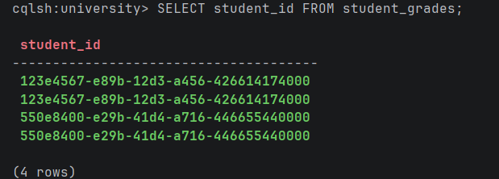
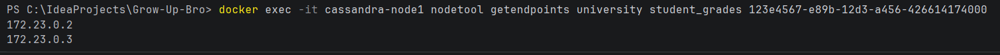
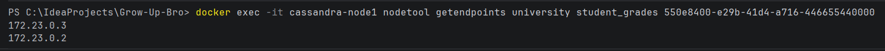
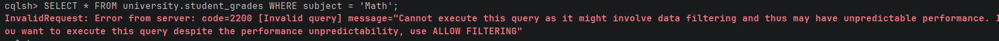
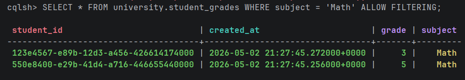

## Задание 1: Инициализация БД с репликацией

Создаём Keyspace `university` с фактором репликации 2

```cassandraql
CREATE KEYSPACE university 
WITH replication = {'class': 'SimpleStrategy', 'replication_factor': 2};
```

## Задание 2: Создание таблицы и данных

Переключаемся на созданный keyspace и создаем таблицу. student_id будет Partition Key (отвечает за то, на какой ноде лежат данные), а created_at — Clustering Key (отвечает за сортировку внутри партиции)

```cassandraql
USE university;

CREATE TABLE student_grades (
    student_id uuid,
    created_at timestamp,
    subject text,
    grade int,
    PRIMARY KEY (student_id, created_at)
);
```

Вставляем данные

```cassandraql
-- Студент 1 (UUID: 550e8400-e29b-41d4-a716-446655440000)
INSERT INTO student_grades (student_id, created_at, subject, grade) 
VALUES (550e8400-e29b-41d4-a716-446655440000, toTimestamp(now()), 'Math', 5);

INSERT INTO student_grades (student_id, created_at, subject, grade) 
VALUES (550e8400-e29b-41d4-a716-446655440000, toTimestamp(now()), 'Physics', 4);

-- Студент 2 (UUID: 123e4567-e89b-12d3-a456-426614174000)
INSERT INTO student_grades (student_id, created_at, subject, grade) 
VALUES (123e4567-e89b-12d3-a456-426614174000, toTimestamp(now()), 'History', 5);

INSERT INTO student_grades (student_id, created_at, subject, grade) 
VALUES (123e4567-e89b-12d3-a456-426614174000, toTimestamp(now()), 'Math', 3);
```

## Задание 3: Проверка распределения данных (Partitioning)

Сначала получим список UUID из базы

```cassandraql
SELECT student_id FROM student_grades;
```


Получает ip-адреса нод с данными каждого uuid:

1. 
```bash
docker exec -it cassandra-node1 nodetool getendpoints university student_grades 123e4567-e89b-12d3-a456-426614174000
```



2. 
```bash
docker exec -it cassandra-node1 nodetool getendpoints university student_grades 550e8400-e29b-41d4-a716-446655440000
```



Так как мы задали фактор репликации replication_factor: 2, хэш от Partition Key (student_id) определил основную ноду для хранения, а координатор скопировал эти данные еще на одну соседнюю ноду для отказоустойчивости


## Задание 4: Работа с фильтрацией

Попытаемся отфильтровать данные по колонке subject, которая не является частью Primary Key

```cassandraql
SELECT * FROM university.student_grades WHERE subject = 'Math';
```


Cassandra запрещает поиск по полям не из первичного ключа, так как ей пришлось бы просканировать все партиции на всех нодах кластера (Full Scan). В больших базах это положит кластер

Выполненим с ALLOW FILTERING

```cassandraql
SELECT * FROM university.student_grades WHERE subject = 'Math' ALLOW FILTERING;
```


Директивой ALLOW FILTERING мы явно берем на себя ответственность за возможные просадки производительности при сканировании всех данных