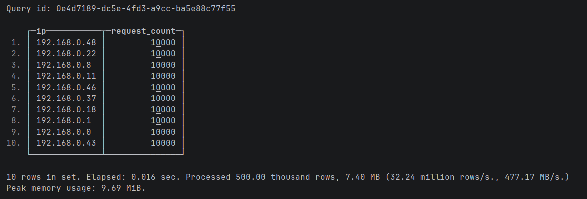
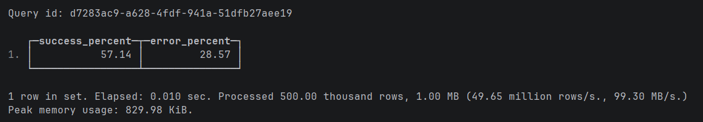
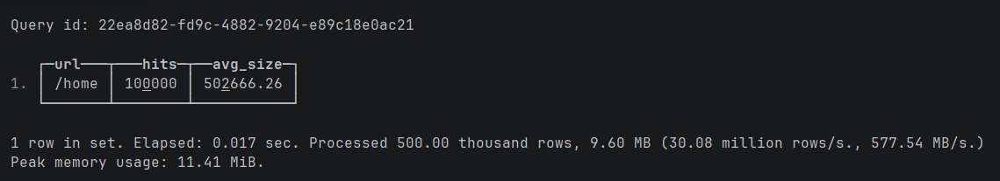
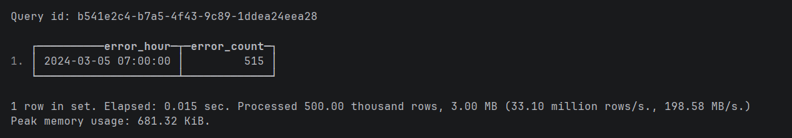
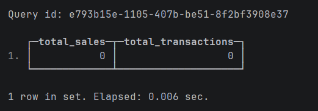
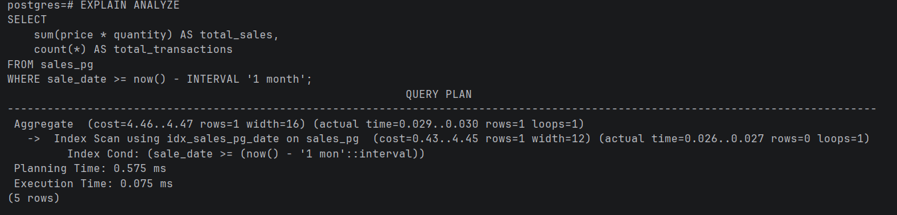
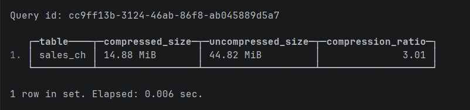
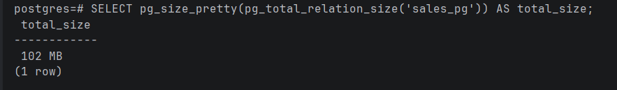
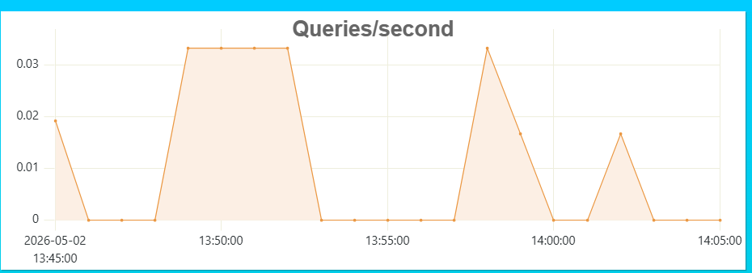
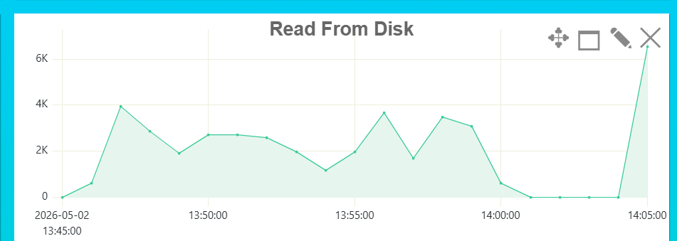

## Задание 1
Создаём таблицу и заполняем данные

```sql
CREATE TABLE web_logs (
    log_time DateTime,
    ip String,
    url String,
    status_code UInt16,
    response_size UInt64
	) ENGINE = MergeTree()
ORDER BY (log_time, status_code);

INSERT INTO web_logs
SELECT
    toDateTime('2024-03-01 00:00:00') + INTERVAL number SECOND,
    concat('192.168.0.', toString(number % 50)),
    arrayElement(['/home', '/api/users', '/api/orders', '/admin', '/products'], number % 5 + 1),
    arrayElement([200, 200, 200, 404, 500, 301, 200], number % 7 + 1),
    rand() % 1000000
FROM numbers(500000);
```

1. Найдите топ-10 IP-адресов по количеству запросов

```sql
SELECT 
    ip, 
    count() AS request_count
FROM web_logs
GROUP BY ip
ORDER BY request_count DESC
LIMIT 10;
```


2. Посчитайте процент успешных запросов (2xx) и ошибочных (4xx, 5xx)

```sql
SELECT 
    round(countIf(status_code >= 200 AND status_code < 300) / count() * 100, 2) AS success_percent,
    round(countIf(status_code >= 400) / count() * 100, 2) AS error_percent
FROM web_logs;
```


3. Найдите самый популярный URL и средний размер ответа для него

```sql
SELECT 
    url, 
    count() AS hits, 
    round(avg(response_size), 2) AS avg_size
FROM web_logs
GROUP BY url
ORDER BY hits DESC
LIMIT 1;
```


4. Определите час с наибольшим количеством ошибок 500

```sql
SELECT 
    toStartOfHour(log_time) AS error_hour, 
    count() AS error_count
FROM web_logs
WHERE status_code = 500
GROUP BY error_hour
ORDER BY error_count DESC
LIMIT 1;
```


## Задание 2

Заполняем данные в ClickHouse

```sql
CREATE TABLE sales_ch (
    sale_date DateTime,
    product_id UInt64,
    category String,
    quantity UInt32,
    price Float64,
    customer_id UInt64
	) ENGINE = MergeTree()
ORDER BY (sale_date);

INSERT INTO sales_ch
SELECT
    toDateTime('2024-01-01 00:00:00') + INTERVAL number MINUTE,
    number % 1000,
    arrayElement(['Electronics', 'Clothing', 'Food', 'Books'], number % 4 + 1),
    rand() % 10 + 1,
    round(rand() % 10000 / 100, 2),
    number % 50000
FROM numbers(1000000);
```

Заполняем данные в PostgreSQL

```sql
CREATE TABLE sales_pg (
    sale_date timestamp,
    product_id bigint,
    category text,
    quantity integer,
    price float8,
    customer_id bigint
);

CREATE INDEX idx_sales_pg_date ON sales_pg(sale_date);
CREATE INDEX idx_sales_pg_product ON sales_pg(product_id);

INSERT INTO sales_pg
SELECT
    '2024-01-01 00:00:00'::timestamp + (n || ' minutes')::interval,
    n % 1000,
    CASE (n % 4)
        WHEN 0 THEN 'Electronics'
        WHEN 1 THEN 'Clothing'
        WHEN 2 THEN 'Food'
        ELSE 'Books'
    END,
    (random() * 9 + 1)::integer,
    round((random() * 100)::numeric, 2),
    n % 50000
FROM generate_series(1, 1000000) AS n;
```

1. Продажи за последний месяц

ClickHouse:

```sql
SELECT 
    sum(price * quantity) AS total_sales, 
    count() AS total_transactions
FROM sales_ch
WHERE sale_date >= now() - INTERVAL 1 MONTH;
```


Отработал запрос за 0.006 sec. Даже на таком малом объеме он показывает стабильно высокую скорость, так как его движок оптимизирован под мгновенный поиск нужных гранул данных без лишних накладных расходов

PostgreSQL:

```sql
EXPLAIN ANALYZE 
SELECT 
    sum(price * quantity) AS total_sales, 
    count(*) AS total_transactions
FROM sales_pg
WHERE sale_date >= now() - INTERVAL '1 month';
```


Время выполнения составило 0.075 ms, но время планирования запроса (0.575 ms) оказалось почти в 7 раз выше самого выполнения. Это типично для строковых СУБД: они тратят много ресурсов на построение сложного дерева плана и проверку консистентности

2. Размер данных на диске

ClickHouse:

```sql
SELECT 
    table, 
    formatReadableSize(sum(data_compressed_bytes)) AS compressed_size, 
    formatReadableSize(sum(data_uncompressed_bytes)) AS uncompressed_size,
    round(sum(data_uncompressed_bytes) / sum(data_compressed_bytes), 2) AS compression_ratio
FROM system.parts
WHERE table = 'sales_ch' AND active
GROUP BY table;
```


PostgreSQL:

```sql
SELECT pg_size_pretty(pg_total_relation_size('sales_pg')) AS total_size;
```


Ответы на вопросы:

1. Какая СУБД быстрее вставила 1 млн строк?
- ClickHouse. Он записывает данные крупными пачками (батчами) и не тратит ресурсы на построчную проверку транзакций и индексов в реальном времени

2. Во сколько раз ClickHouse сжал данные эффективнее?
- ClickHouse показал высокую эффективность хранения - данные на диске занимают всего 14.88 MiB против 102 MB в PostgreSQL. Таким образом, ClickHouse эффективнее в 6.5 раз

3. Какой вывод можно сделать о выборе СУБД для аналитики?
- Для тяжелых вычислений над миллионами строк (SUM, AVG, GROUP BY) нужно выбирать OLAP-системы (ClickHouse). Они минимизируют чтение с диска, используя только нужные колонки, и обрабатывают данные параллельно

4. Разница ClickHouse и PostgreSQL
- PostgreSQL — для транзакций (OLTP). Быстро работает с конкретными строками (юзеры, заказы), гарантирует целостность данных. ClickHouse — для аналитики (OLAP). Быстро работает с огромными массивами данных (логи, метрики), но плохо подходит для точечных обновлений или удаления строк

## Задание 3

Ключевые дашборды во время выполнения задания:

1. Queries/second (QPS)


Значения очень маленькие (около 0.03 QPS). ClickHouse в продакшене легко держит тысячи таких запросов, если они оптимизированы

2. Read From Disk


Видим резкий скачок до 6K+ - в этот момент был запрос, который заставил базу "прочитать" много данных

Итог: Заметим, что количество запросов (QPS) в 14:05 не выросло, а чтение с диска взлетело. Это классический пример тяжелого аналитического запроса: запрос один, а данных он перебирает гигабайты

