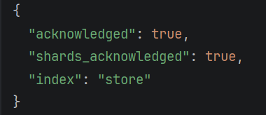

## Создание индекса
```http request
PUT http://localhost:9200/store
Content-Type: application/json

{
  "mappings": {
    "properties": {
      "title": {
        "type": "text",
        "analyzer": "russian"
      },
      "price": {
        "type": "float"
      },
      "available": {
        "type": "boolean"
      }
    }
  }
}

```


## Добавление документов
```http request
POST http://localhost:9200/store/_bulk
Content-Type: application/json

{"index": {"_index": "first_index", "_id": "2"}}
{"title": "Активный стилус", "price": 272.87, "available": true}
{"index": {"_index": "first_index", "_id": "3"}}
{"title": "Кулер для процессора", "price": 200.14, "available": true}
{"index": {"_index": "first_index", "_id": "4"}}
{"title": "Селфи-палка", "price": 61.6, "available": true}
{"index": {"_index": "first_index", "_id": "5"}}
{"title": "Внешний аккумулятор", "price": 198.49, "available": true}
{"index": {"_index": "first_index", "_id": "6"}}
{"title": "Смарт-часы", "price": 181.26, "available": true}
{"index": {"_index": "first_index", "_id": "7"}}
{"title": "Мышь беспроводная", "price": 94.08, "available": false}
{"index": {"_index": "first_index", "_id": "8"}}
{"title": "Внешний диск 2TB", "price": 177.49, "available": true}
{"index": {"_index": "first_index", "_id": "9"}}
{"title": "Процессор", "price": 125.64, "available": false}
{"index": {"_index": "first_index", "_id": "10"}}
{"title": "Видеокарта", "price": 238.9, "available": true}

```
```json
{
  "took": 19,
  "errors": false,
  "items": [
    {
      "index": {
        "_index": "store",
        "_type": "_doc",
        "_id": "2",
        "_version": 1,
        "result": "created",
        "_shards": {
          "total": 2,
          "successful": 1,
          "failed": 0
        },
        "_seq_no": 0,
        "_primary_term": 1,
        "status": 201
      }
    },
    {
      "index": {
        "_index": "store",
        "_type": "_doc",
        "_id": "3",
        "_version": 1,
        "result": "created",
        "_shards": {
          "total": 2,
          "successful": 1,
          "failed": 0
        },
        "_seq_no": 1,
        "_primary_term": 1,
        "status": 201
      }
    },
    {
      "index": {
        "_index": "store",
        "_type": "_doc",
        "_id": "4",
        "_version": 1,
        "result": "created",
        "_shards": {
          "total": 2,
          "successful": 1,
          "failed": 0
        },
        "_seq_no": 2,
        "_primary_term": 1,
        "status": 201
      }
    },
    {
      "index": {
        "_index": "store",
        "_type": "_doc",
        "_id": "5",
        "_version": 1,
        "result": "created",
        "_shards": {
          "total": 2,
          "successful": 1,
          "failed": 0
        },
        "_seq_no": 3,
        "_primary_term": 1,
        "status": 201
      }
    },
    {
      "index": {
        "_index": "store",
        "_type": "_doc",
        "_id": "6",
        "_version": 1,
        "result": "created",
        "_shards": {
          "total": 2,
          "successful": 1,
          "failed": 0
        },
        "_seq_no": 4,
        "_primary_term": 1,
        "status": 201
      }
    },
    {
      "index": {
        "_index": "store",
        "_type": "_doc",
        "_id": "7",
        "_version": 1,
        "result": "created",
        "_shards": {
          "total": 2,
          "successful": 1,
          "failed": 0
        },
        "_seq_no": 5,
        "_primary_term": 1,
        "status": 201
      }
    },
    {
      "index": {
        "_index": "store",
        "_type": "_doc",
        "_id": "8",
        "_version": 1,
        "result": "created",
        "_shards": {
          "total": 2,
          "successful": 1,
          "failed": 0
        },
        "_seq_no": 6,
        "_primary_term": 1,
        "status": 201
      }
    },
    {
      "index": {
        "_index": "store",
        "_type": "_doc",
        "_id": "9",
        "_version": 1,
        "result": "created",
        "_shards": {
          "total": 2,
          "successful": 1,
          "failed": 0
        },
        "_seq_no": 7,
        "_primary_term": 1,
        "status": 201
      }
    },
    {
      "index": {
        "_index": "store",
        "_type": "_doc",
        "_id": "10",
        "_version": 1,
        "result": "created",
        "_shards": {
          "total": 2,
          "successful": 1,
          "failed": 0
        },
        "_seq_no": 8,
        "_primary_term": 1,
        "status": 201
      }
    }
  ]
}
```

## Запросы

1. Полнотекстовый поиск (Match)

Находит "Процессор", "процессора" и т.д.

```http request
GET http://localhost:9200/store/_search
Content-Type: application/json

{
  "query": {
    "match": {
      "title": "процессор"
    }
  }
}

```
```json
{
  "took": 77,
  "timed_out": false,
  "_shards": {
    "total": 1,
    "successful": 1,
    "skipped": 0,
    "failed": 0
  },
  "hits": {
    "total": {
      "value": 2,
      "relation": "eq"
    },
    "max_score": 1.7168015,
    "hits": [
      {
        "_index": "store",
        "_type": "_doc",
        "_id": "9",
        "_score": 1.7168015,
        "_source": {
          "title": "Процессор",
          "price": 125.64,
          "available": false
        }
      },
      {
        "_index": "store",
        "_type": "_doc",
        "_id": "3",
        "_score": 1.3537182,
        "_source": {
          "title": "Кулер для процессора",
          "price": 200.14,
          "available": true
        }
      }
    ]
  }
}
```

2. Поиск по точному значению (Term)

Находим товары, которых нет в наличии

```http request
GET http://localhost:9200/store/_search
Content-Type: application/json

{
  "query": {
    "term": {
      "available": false
    }
  }
} 

```
```json
{
  "took": 5,
  "timed_out": false,
  "_shards": {
    "total": 1,
    "successful": 1,
    "skipped": 0,
    "failed": 0
  },
  "hits": {
    "total": {
      "value": 2,
      "relation": "eq"
    },
    "max_score": 1.3862942,
    "hits": [
      {
        "_index": "store",
        "_type": "_doc",
        "_id": "7",
        "_score": 1.3862942,
        "_source": {
          "title": "Мышь беспроводная",
          "price": 94.08,
          "available": false
        }
      },
      {
        "_index": "store",
        "_type": "_doc",
        "_id": "9",
        "_score": 1.3862942,
        "_source": {
          "title": "Процессор",
          "price": 125.64,
          "available": false
        }
      }
    ]
  }
}
```
3. Поиск по диапазону (Range)

Товары с ценой от 50 до 150

```http request
GET http://localhost:9200/store/_search
Content-Type: application/json

{
  "query": {
    "range": {
      "price": {
        "gte": 50,
        "lte": 150
      }
    }
  }
}

```
```json
{
  "took": 11,
  "timed_out": false,
  "_shards": {
    "total": 1,
    "successful": 1,
    "skipped": 0,
    "failed": 0
  },
  "hits": {
    "total": {
      "value": 3,
      "relation": "eq"
    },
    "max_score": 1.0,
    "hits": [
      {
        "_index": "store",
        "_type": "_doc",
        "_id": "4",
        "_score": 1.0,
        "_source": {
          "title": "Селфи-палка",
          "price": 61.6,
          "available": true
        }
      },
      {
        "_index": "store",
        "_type": "_doc",
        "_id": "7",
        "_score": 1.0,
        "_source": {
          "title": "Мышь беспроводная",
          "price": 94.08,
          "available": false
        }
      },
      {
        "_index": "store",
        "_type": "_doc",
        "_id": "9",
        "_score": 1.0,
        "_source": {
          "title": "Процессор",
          "price": 125.64,
          "available": false
        }
      }
    ]
  }
}
```

4. Комбинированный поиск (Bool)

Обязательно в наличии И цена больше 200

```http request
GET http://localhost:9200/store/_search
Content-Type: application/json

{
  "query": {
    "bool": {
      "must": [
        { "term": { "available": true } }
      ],
      "filter": [
        { "range": { "price": { "gt": 200 } } }
      ]
    }
  }
}

```
```json
{
  "took": 9,
  "timed_out": false,
  "_shards": {
    "total": 1,
    "successful": 1,
    "skipped": 0,
    "failed": 0
  },
  "hits": {
    "total": {
      "value": 3,
      "relation": "eq"
    },
    "max_score": 0.2876821,
    "hits": [
      {
        "_index": "store",
        "_type": "_doc",
        "_id": "2",
        "_score": 0.2876821,
        "_source": {
          "title": "Активный стилус",
          "price": 272.87,
          "available": true
        }
      },
      {
        "_index": "store",
        "_type": "_doc",
        "_id": "3",
        "_score": 0.2876821,
        "_source": {
          "title": "Кулер для процессора",
          "price": 200.14,
          "available": true
        }
      },
      {
        "_index": "store",
        "_type": "_doc",
        "_id": "10",
        "_score": 0.2876821,
        "_source": {
          "title": "Видеокарта",
          "price": 238.9,
          "available": true
        }
      }
    ]
  }
}
```

