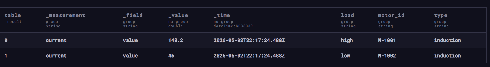
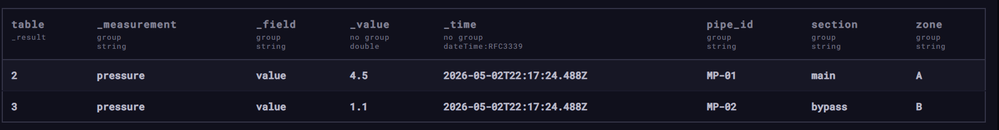
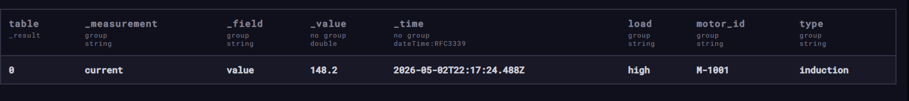
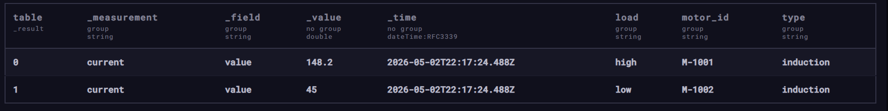
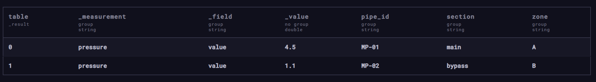
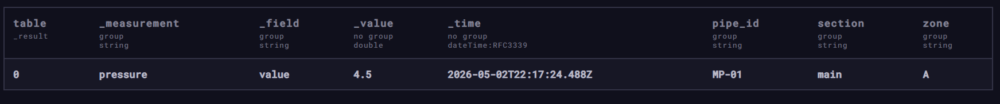
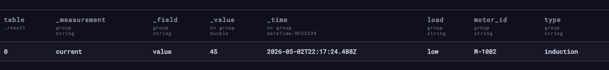
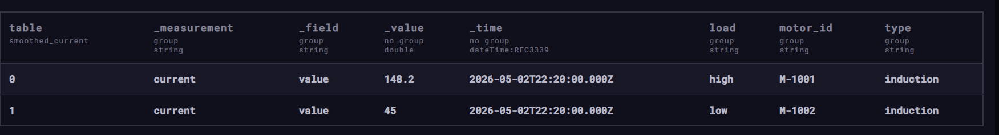
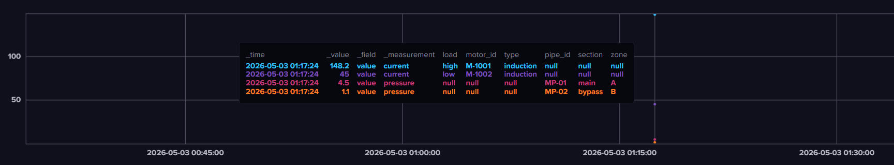
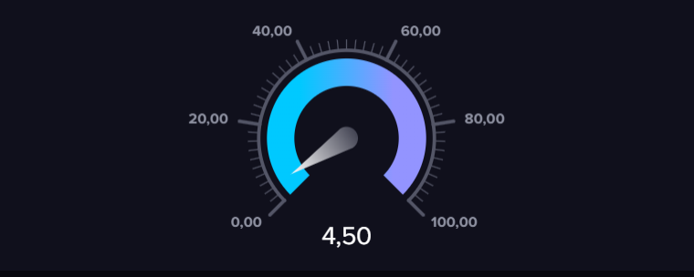

## Создание базы через веб-интерфейс


## Наполнение данными через Line Protocol

Вставляем данные о промышленных датчиках

```
current,motor_id=M-1001,type=induction,load=high value=145.5
current,motor_id=M-1001,type=induction,load=high value=148.2
current,motor_id=M-1002,type=induction,load=low value=45.0
pressure,pipe_id=MP-01,section=main,zone=A value=4.2
pressure,pipe_id=MP-01,section=main,zone=A value=4.5
pressure,pipe_id=MP-02,section=bypass,zone=B value=1.1
```

## Базовые запросы на Flux

1. Все данные за последние 30 минут

```flux
from(bucket: "industry_sensors")
  |> range(start: -30m)
```




2. Измерения только 1 датчика (motor_id=M-1001)

```flux
from(bucket: "industry_sensors")
  |> range(start: -30m)
  |> filter(fn: (r) => r["motor_id"] == "M-1001")
```


3. Максимальное значение на датчике

```flux
from(bucket: "industry_sensors")
  |> range(start: -1h)
  |> filter(fn: (r) => r["_measurement"] == "current")
  |> max()
```


4. Среднее значение на датчике

```flux
from(bucket: "industry_sensors")
  |> range(start: -1h)
  |> filter(fn: (r) => r["_measurement"] == "pressure")
  |> mean()
```


5. Аналитические запросы с фильтрацией по значению

- Найти все случаи критического давления (> 4.0)

```flux
from(bucket: "industry_sensors")
  |> range(start: -1h)
  |> filter(fn: (r) => r["_measurement"] == "pressure")
  |> filter(fn: (r) => r["_value"] > 4.0)
```



- Найти двигатели с низким потреблением (< 50.0)

```flux
from(bucket: "industry_sensors")
  |> range(start: -1h)
  |> filter(fn: (r) => r["_measurement"] == "current")
  |> filter(fn: (r) => r["_value"] < 50.0)
```


6. Агрегация данных

Сгруппируем данные по 5-минутным интервалам и посчитаем среднее

```flux
from(bucket: "industry_sensors")
  |> range(start: -1h)
  |> filter(fn: (r) => r._measurement == "current")
  |> aggregateWindow(every: 5m, fn: mean)
```


## Dashboard

1. График со всеми данными за последние 30 минут (1 запрос)



2. Среднее значение давления на датчике (4 запрос) (конкретно для M-1001)

