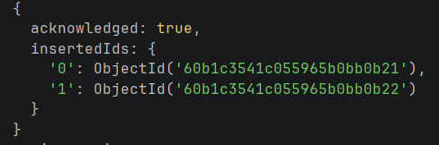
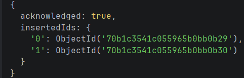
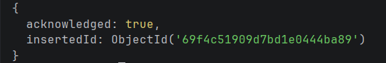
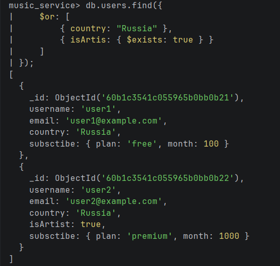
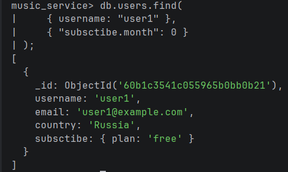
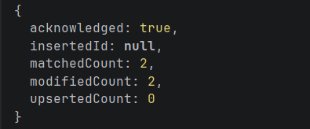
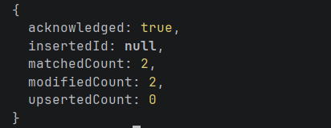
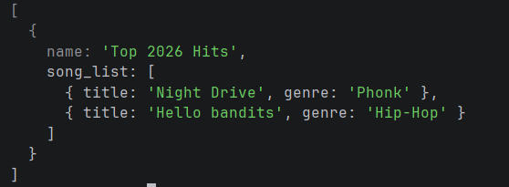

## Создание коллекций и наполнение данными

1. Коллекция Пользователей (Артистов)
```mongodb-json
db.users.insertMany([
  {
    _id: ObjectId("60b1c3541c055965b0bb0b21"),
    username: "user1",
    email: "user1@example.com",
    country: "Russia",
    subsctibe: { plan: "free", month: 100 }
  },
  {
    _id: ObjectId("60b1c3541c055965b0bb0b22"),
    username: "user2",
    email: "user2@example.com",
    country: "Russia",
    isArtist: true,
    subsctibe: { plan: "premium", month: 1000 }
  }
]);
```



2. Коллекция Треков (Связь через ObjectId к артисту)

```mongodb-json
db.tracks.insertMany([
  {
    _id: ObjectId("70b1c3541c055965b0bb0b29"),
    title: "Hello bandits",
    durationMs: 180000,
    artistId: ObjectId("60b1c3541c055965b0bb0b22"),
    genre: "Hip-Hop",
    album: "Album 1"
  },
  {
    _id: ObjectId("70b1c3541c055965b0bb0b30"),
    title: "Night Drive",
    durationMs: 210000,
    artistId: ObjectId("60b1c3541c055965b0bb0b22"),
    genre: "Phonk",
    album: "Single"
  }
]);
```


3. Коллекция Плейлистов (Массив ObjectId)

```mongodb-json
db.playlists.insertOne({
  name: "Top 2026 Hits",
  owner: "user1",
  trackIds: [
    ObjectId("70b1c3541c055965b0bb0b29"),
    ObjectId("70b1c3541c055965b0bb0b30")
  ],
  tags: ["energy", "workout"]
});
```



## Find запросы

1. Найдем всех пользователей, которые либо живут в России, либо у них есть поле isArtist

```mongodb-json
db.users.find({
    $or: [
        { country: "Russia" },
        { isArtist: { $exists: true } }
    ]
});
```


2. Найдем пользователей с именем user1, но со скрытым полем month в подписке

```mongodb-json
db.users.find(
    { username: "user1" },
    { "subsctibe.month": 0 } 
);
```


## Update запросы

1. Увеличим стоимость подписки на 150 единиц для всех пользователей

```mongodb-json
db.users.updateMany(
    {}, 
    { $inc: { "subsctibe.month": 150 } }
);
```


2. Переименуем поле subsctibe во всех документах коллекции users (исправление опечатки)

```mongodb-json
db.users.updateMany(
    {}, 
    { $rename: { "subsctibe": "subscribe" } }
);
```


## Запросы с aggregate

```mongodb-json
db.playlists.aggregate([
  { $match: { name: "Top 2026 Hits" } },

  {
    $lookup: {
      from: "tracks",
      localField: "trackIds",
      foreignField: "_id",
      as: "song_list"
    }
  },

  {
    $project: {
      _id: 0, 
      name: 1,
      "song_list.title": 1,
      "song_list.genre": 1
    }
  }
]);
```


