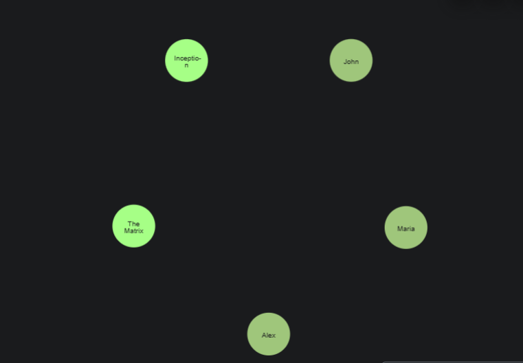
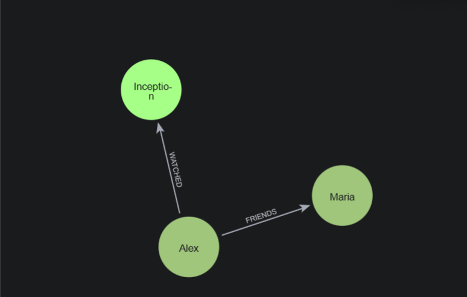
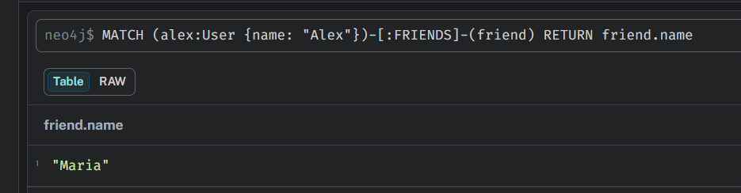

## Задача струкруры

1. Создание пользователей

```cypher
CREATE (alex:User {name: "Alex"}),
       (maria:User {name: "Maria"}),
       (john:User {name: "John"});
```

2. Создание фильмов

```cypher
CREATE (inception:Movie {title: "Inception"}),
       (matrix:Movie {title: "The Matrix"});
```

3. Создание связей

```cypher
MATCH (a:User {name: "Alex"}), (m:User {name: "Maria"})
CREATE (a)-[:FRIENDS]->(m);

MATCH (a:User {name: "Alex"}), (i:Movie {title: "Inception"})
CREATE (a)-[:WATCHED {rating: 5}]->(i);
```
Все ноды:



Все связи:



## Запросы

1. Найдём всех друзей Алекса

```cypher
MATCH (alex:User {name: "Alex"})-[:FRIENDS]-(friend)
RETURN friend.name;
```



2. Найдём фильмы, которые смотрели друзья Алекса, но не смотрел сам Алекс

```cypher
MATCH (alex:User {name: "Alex"})-[:FRIENDS]-(friend)-[:WATCHED]->(movie:Movie)
WHERE NOT (alex)-[:WATCHED]->(movie)
RETURN DISTINCT movie.title;
```


## Сравнение с SQL

1. Поиск всех друзей Алекса

```sql
SELECT u_friend.name
FROM users u_alex
JOIN friends f ON u_alex.id = f.user_id
JOIN users u_friend ON f.friend_id = u_friend.id
WHERE u_alex.name = 'Alex';
```
2. Фильмы, которые смотрели друзья, но не смотрел Алекс

```sql
SELECT DISTINCT m.title
FROM users u_alex
-- 1. Находим друзей Алекса
JOIN friends f ON u_alex.id = f.user_id
-- 2. Находим фильмы, которые они смотрели
JOIN watched_movies wm_friend ON f.friend_id = wm_friend.user_id
JOIN movies m ON wm_friend.movie_id = m.id
WHERE u_alex.name = 'Alex'
-- 3. Исключаем фильмы, которые смотрел сам Алекс
AND m.id NOT IN (
    SELECT movie_id 
    FROM watched_movies 
    WHERE user_id = u_alex.id
);
```

В Neo4j (Cypher) описывается рисунок связи - код короткий и наглядный, в то время как в SQL описывается объединение таблиц - нужно много JOIN и промежуточных таблиц, что загромождает код

Также в Neo4j вычислительная сложность O(1) за шаг - БД просто переходит по «ссылкам» в памяти, в то время как в SQL O(log N) за шаг - БД каждый раз ищет совпадения по индексам; чем больше таблица, тем медленнее поиск