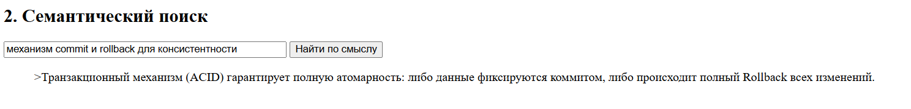
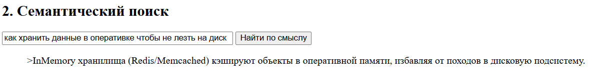
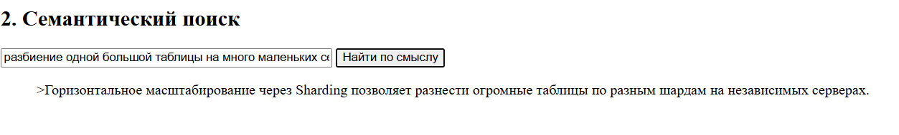
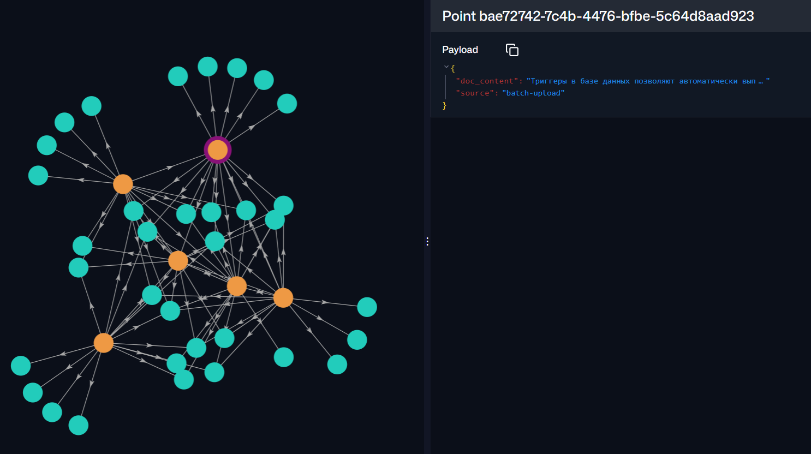

## Добавление текста для векторизации

Добавляем текст, разделённый ;

```
Транзакционный механизм (ACID) гарантирует полную атомарность: либо данные фиксируются коммитом, либо происходит полный Rollback всех изменений.;
Индексация через B-Tree или Gin существенно ускоряет SELECT запросы, но создает оверхед на дисковое пространство.;
Репликация (Master-Slave) обеспечивает отказоустойчивость, создавая дубликаты данных на резервных нодах.;
Горизонтальное масштабирование через Sharding позволяет разнести огромные таблицы по разным шардам на независимых серверах.;
InMemory хранилища (Redis/Memcached) кэшируют объекты в оперативной памяти, избавляя от походов в дисковую подсистему.;
Нормализация в реляционных БД до третьей нормальной формы (3NF) устраняет избыточность и аномалии обновления.;
Пессимистические и оптимистические блокировки решают проблему потерянных обновлений при конкурентном доступе.;
Семантический поиск через эмбеддинги понимает контекст фразы, а не просто ищет совпадение подстроки в тексте.;
Хранение в JSONB формате в Postgres дает гибкость NoSQL баз с сохранением строгой типизации и индексов.;
WAL-логи (Write Ahead Log) гарантируют восстановление данных после внезапного падения сервера или отключения питания.
```

## Семантический поиск

1. Механизм commit и rollback для консистентности


Ответ: про транзакции и ACID

2. Как хранить данные в оперативке чтобы не лезть на диск?



Ответ: про InMemory / Redis

3. Разбиение одной большой таблицы на много маленьких серверов



Ответ: про Sharding

## Как выглядят данные



На графе видно, что данные распределены кластерами. Например, точки, связанные с производительностью (индексы, кэш), находятся в одной области, а точки про надежность (WAL, транзакции) — в другой. Это демонстрирует работу алгоритма HNSW: поиск происходит не перебором всей базы (O(N)), а переходом по связям между близкими узлами (O(log N))