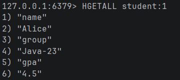
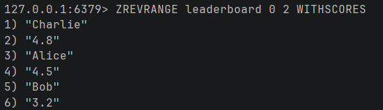
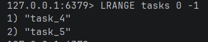
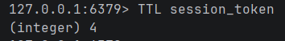
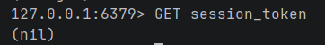
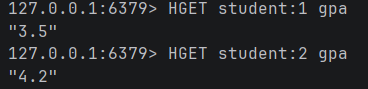

## Задание 1. Hash — данные о студентах
Создаём 3 студентов, используя Hash

```redis
HSET student:1 name "Alice" group "Java-23" gpa 4.5
HSET student:2 name "Bob" group "Java-23" gpa 3.2
HSET student:3 name "Charlie" group "Java-23" gpa 4.8
```

Проверяем (выводим все поля первого студента)

```redis
HGETALL student:1
```


## Задание 2. Sorted Set — лидерборд по GPA
Создаём рейтинг студентов по среднему баллу

```redis
ZADD leaderboard 4.5 "Alice"
ZADD leaderboard 3.2 "Bob"
ZADD leaderboard 4.8 "Charlie"
```

Топ-3 по убыванию

```redis
ZREVRANGE leaderboard 0 2 WITHSCORES
```


## Задание 3. List — очередь задач

Добавляем 5 задач в очередь

```redis
RPUSH tasks "task_1" "task_2" "task_3" "task_4" "task_5"
```

Забираем 3 задачи

```redis
LPOP tasks
LPOP tasks
LPOP tasks
```

Проверяем, что осталось 2 задачи

```redis
LRANGE tasks 0 -1
```


## Задание 4. TTL — время жизни ключа

Создаём ключ с TTL 10 секунд

```redis
SET session_token "abc-123" EX 10
```

Сразу проверяем остаток времени

```redis
TTL session_token
```



Ждём 10 секунд и попробуем получить

```redis
GET session_token
```


## Задание 5. Транзакция MULTI/EXEC

```redis
# Отнимаем 1 балл у студента 1
HINCRBYFLOAT student:1 gpa -1.0

# Добавляем 1 балл студенту 2
HINCRBYFLOAT student:2 gpa 1.0

# Выполняем обе команды одной пачкой
EXEC
```
Проверяем результат

```redis
HGET student:1 gpa
HGET student:2 gpa
```
