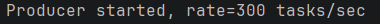
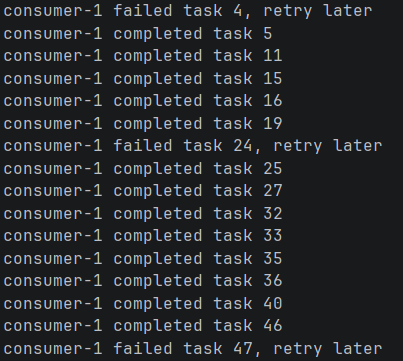
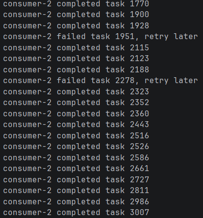
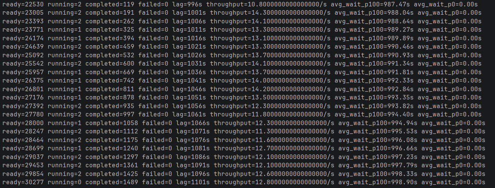

## 1. Проектирование БД

У нас будет таблица `main.plant_care_event` с бизнес логикой связыванию растений с событиями по уходу и сама таблица `queue.tasks` с очередью событий:

- обычная задача: `NORMAL_PLANT_CHECK`, `priority = 0` - 80%
- критическая задача: `CRITICAL_PLANT_CHECK`, `priority = 100` - 20%

```sql
CREATE TABLE main.plant_care_event (
    id BIGSERIAL PRIMARY KEY,
    plant_id INT REFERENCES main.plant(id),
    event_type TEXT NOT NULL,
    created_at TIMESTAMPTZ NOT NULL DEFAULT now()
);
```
```sql
CREATE TABLE queue.tasks (
    id BIGSERIAL PRIMARY KEY,
    task_type TEXT NOT NULL,
    payload JSONB NOT NULL DEFAULT '{}'::jsonb,
    priority INT NOT NULL DEFAULT 0,
    status TEXT NOT NULL DEFAULT 'Ready',
    attempts INT NOT NULL DEFAULT 0,
    max_attempts INT NOT NULL DEFAULT 5,
    scheduled_at TIMESTAMPTZ NOT NULL DEFAULT now(),
    created_at TIMESTAMPTZ NOT NULL DEFAULT now(),
    started_at TIMESTAMPTZ,
    completed_at TIMESTAMPTZ,
    worker_name TEXT,
    error TEXT
);
```

## 2. Продьюсер (код в проекте `queue-java`)
Продьюсер делает две операции в одной транзакции:

1. вставляет бизнес-событие в `main.plant_care_event`
2. вставляет задачу в `queue.tasks`

Если одна из операций упадет, вся транзакция откатится

## 3. Консьюмеры (код в проекте `queue-java`)

Консьюмер берет задачу таким запросом:

```sql
WITH picked AS (
    SELECT id
    FROM queue.tasks
    WHERE status = 'Ready'
      AND scheduled_at <= now()
    ORDER BY priority DESC, created_at ASC
    LIMIT 1
    FOR UPDATE SKIP LOCKED
)
UPDATE queue.tasks t
SET status = 'Running', started_at = now(), worker_name = :workerName
FROM picked
WHERE t.id = picked.id
RETURNING t.id, t.priority;
```

`FOR UPDATE SKIP LOCKED` позволяет двум консьюмерам не брать одну и ту же задачу

## 4. Нагрузка и мониторинг Лага

Запускаем нашего продьюсера на высокую интенсивность (300 вставок в секунду):



Затем наших консьюмеров:





И переходим к запуску мониторинга лага:

Для мониторинга используется агрегирующий SQL-запрос по таблице `queue.tasks`:

```sql
SELECT
    count(*) FILTER (WHERE status = 'Ready') AS ready,
    count(*) FILTER (WHERE status = 'Running') AS running,
    count(*) FILTER (WHERE status = 'Completed') AS completed,
    count(*) FILTER (WHERE status = 'Failed') AS failed,
    coalesce(extract(epoch FROM now() - min(created_at) FILTER (WHERE status = 'Ready')), 0)::int AS lag_seconds,
    count(*) FILTER (
        WHERE status IN ('Completed', 'Failed')
          AND completed_at >= now() - interval '10 seconds'
    ) / 10.0 AS throughput_per_sec,
    coalesce(avg(extract(epoch FROM started_at - created_at)) FILTER (WHERE priority = 100 AND started_at IS NOT NULL), 0)::numeric(10,2) AS avg_wait_priority_100,
    coalesce(avg(extract(epoch FROM started_at - created_at)) FILTER (WHERE priority = 0 AND started_at IS NOT NULL), 0)::numeric(10,2) AS avg_wait_priority_0
FROM queue.tasks;
```

- `ready` — количество задач, ожидающих обработки
- `running` — количество задач, которые сейчас взяты консьюмерами
- `completed` — количество успешно обработанных задач
- `failed` — количество задач, завершившихся ошибкой
- `lag_seconds` — лаг очереди в секундах. Он считается как разница между текущим временем и временем создания самой старой задачи в статусе `Ready`
- `throughput_per_sec` — пропускная способность консьюмеров: сколько задач было завершено за последние 10 секунд, делённое на 10
- `avg_wait_priority_100` — среднее время ожидания критических задач до начала обработки
- `avg_wait_priority_0` — среднее время ожидания обычных задач до начала обработки

Логи:



### Анализ результатов

1. Во время выполнения теста количество задач в статусе Ready постоянно увеличивалось. Это означает, что скорость генерации задач значительно превышала скорость обработки очереди двумя воркерами

2. Параметр lag также постепенно увеличивался. Лаг показывает, сколько времени ожидает самая старая задача в очереди. Рост лага подтверждает накопление необработанных задач

3. Пропускная способность оставалась примерно стабильной и составляла около 11–14 задач в секунду

4. Проверка приоритетов:

- Для проверки приоритетной обработки использовались две категории задач: обычные задачи (priority = 0) и критические задачи (priority = 100)

- Монитор рассчитывал среднее время ожидания перед началом обработки (`avg_wait_p100`, `avg_wait_p0`)

- Во время нашего нагрузочного тестирования значение `avg_wait_p0` оставалось близким к нулю, так как консьюмеры практически не успевали доходить до обработки обычных задач. Это демонстрирует, что задачи с высоким приоритетом (priority=100) выбирались системой раньше обычных (priority=0), так как консьюмеры выбирали задачи с сортировкой по приоритету: `ORDER BY priority DESC, created_at`

## 5. Retry

Если задача завершилась ошибкой, консьюмер:

- увеличивает `attempts`
- если лимит попыток не исчерпан, возвращает задачу в `Ready`
- переносит `scheduled_at` в будущее по exponential backoff
- если попытки закончились, ставит статус `Failed`

Формула задержки, которую мы используем для расчета `scheduled_at`:

```sql
now() + power(2, attempts) * interval '5 minutes'
```

## 6. NOTIFY

Консьюмер подписывается на канал уведомлений:

```sql
LISTEN plant_tasks;
```

Продьюсер после вставки задачи вызывает:

```sql
NOTIFY plant_tasks, 'new_task';
```

Если задач в очереди нет, консьюмер ожидает уведомление 1000 мс:

```java
pgConnection.getNotifications(1000);
```

Если уведомление не поступило, цикл продолжается, и консьюмер повторно проверяет очередь

Таким образом вместо постоянного polling консьюмеры переходят в режим ожидания и получают сигнал о появлении новых задач через механизм PostgreSQL LISTEN / NOTIFY

## 7. Bloat и VACUUM

Для таблицы очереди настроен более агрессивный autovacuum:

```sql
ALTER TABLE queue.tasks SET (
    autovacuum_vacuum_scale_factor = 0.01,
    autovacuum_analyze_scale_factor = 0.005,
    autovacuum_vacuum_threshold = 50,
    autovacuum_analyze_threshold = 50
);
```
